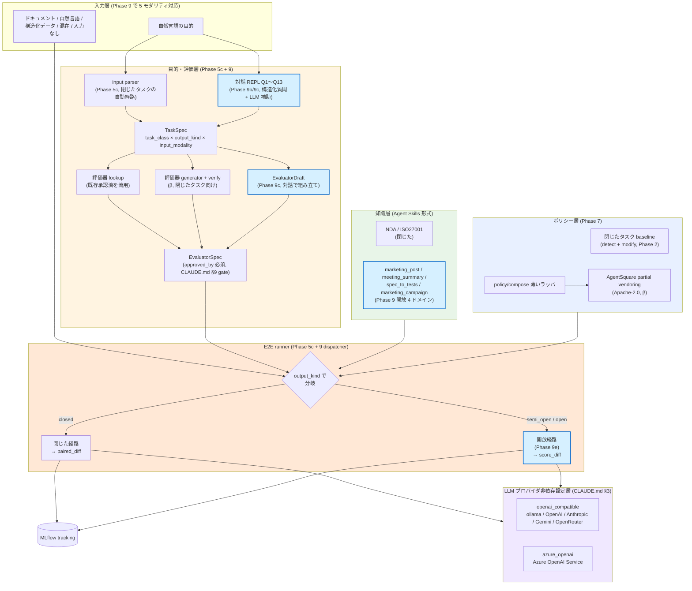
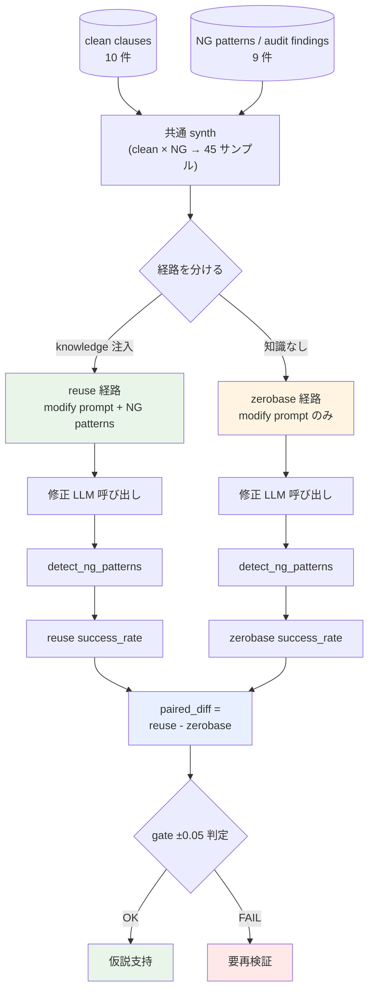
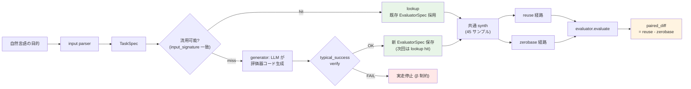
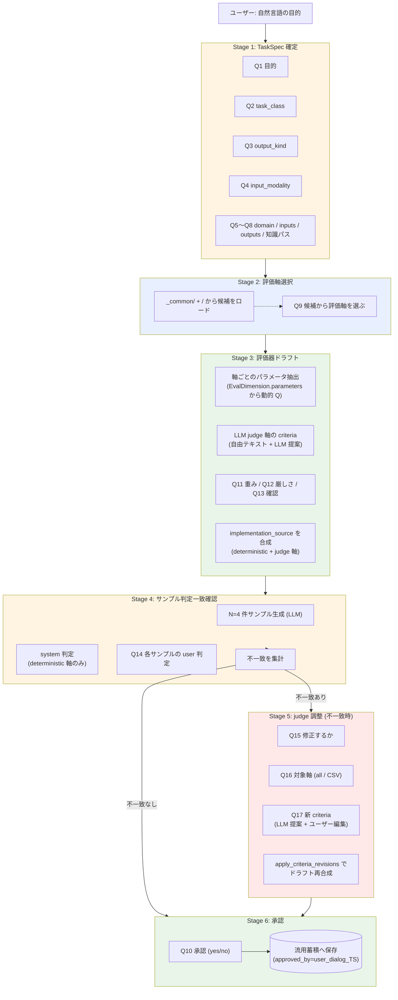

前回記事「[【Agentic AI 検証】知識層は本当に再利用できるのか](https://zenn.dev/jnch/articles/68b0ede8c04aa8)」では、NDA ドメインを舞台に「知識層の再利用は本当に効くのか」を測りました。結論は弱モデル (Qwen 2.5 14B) で paired_diff +0.212、強モデル (Azure GPT-5.4) で +0.074 に縮小という、ややしょっぱい数字でした。

この記事はその続編です。前回までで「知識層単体ではモデル能力差を埋めきれない」と分かったうえで、では Agentic AI の **「再利用の土俵そのもの」** をどう組み立てれば良いのか、という問いに踏み込みます。1 ヶ月で実装した **4 つの追加検証** (目的駆動 E2E / ISO27001 への横展開 / AgentSquare 統合 / 対話的評価器生成 + 開放タスク N=4) を 1 本にまとめてお届けします。

## 全体像

| 項目 | 内容 |
| --- | --- |
| 続編で追加した検証 | Phase 5c (目的駆動 E2E) / Phase 6 (ISO27001 横展開) / Phase 7 (AgentSquare 統合) / **Phase 9 (対話的評価器生成 + 開放タスク N=4)** |
| 主な数値 (閉じたタスク) | NDA paired_diff +0.261、ISO27001 paired_diff +0.029、N=2 ドメインで仮説再現 |
| 主な数値 (開放タスク, Phase 9) | 4 ドメインの score_diff 平均 +0.407 (Azure gpt-5.4, seed=42) |
| フレームワーク | tsumiki (`src/tsumiki/`)、AgentSquare を partial vendoring (Apache-2.0) |
| 再現性 | 416 件の unit test PASS (Phase 9 まで)、`uv` + `Docker` + `MLflow`、`temperature=0` + seed 固定 |
| 公開 | GitHub `Jncch/tsumiki` を Apache-2.0 で公開 |

## この記事で扱うこと

| 扱う | 扱わない |
| --- | --- |
| 自然言語目的 → TaskSpec → 評価器流用 → E2E 完走の経路 | エンドユーザー向け UI、Web アプリ |
| 閉じたタスクのドメイン横展開 (NDA + ISO27001 で N=2) の数値再現 | 閉じた N=3 以上の追加ドメイン (Phase 10+ で予定) |
| AgentSquare の取り込み方針と LLM 差し替えの実装手順 | AgentSquare 探索の本格的な hyperparameter 最適化 |
| 評価器 gate を強制する設計 (CLAUDE.md §9) | LLM judge の人手較正 (β 機能扱い) |
| **対話的評価器生成 (3 直交軸 / Q1〜Q13 構造化対話) と開放タスク 4 ドメイン試走 (Phase 9)** | **LLM judge_panel/pairwise の本走採点 (Phase 10+ で実装、Phase 9 では deterministic 軸のみ採点)** |
| OSS 公開時の正直な β 機能の扱い | benchmark_fn の本物実装 (Phase 10+ 持ち越し) |

## 0. 前回記事との関係

前回記事の主題は「ドメイン辞書を 1 つ書けば、別タスクへ流用して工数削減・性能維持できるか」でした。結論として paired_diff は弱モデルで +0.212、強モデルで +0.074。**「モデル能力 > 知識層の品質」** という、知識層単体への期待を絞り込む結果になりました。

本稿で扱うのはその次の問いです。

> モデル能力で半分は決まる。では残り半分の「土俵 (= 再利用するための骨格)」をどう設計するか?

「土俵」というのは、目的駆動の自然言語入力 → 構造化スキーマ → 評価器の流用判定 → 知識・ツール層のロード → ポリシー層の合成、というパイプライン全体のことです。前回はこの土俵が暗黙的に NDA 専用でしたが、本稿では **TaskSpec / EvaluatorSpec という共通骨格** を導入し、ISO27001 を 2 つめのドメインとして同じ土俵に乗せ、最後に AgentSquare の探索エンジンを薄いラッパでつなぎます。

## 1. 前回の結論と残った 3 つの問い

前回記事で出した数値を再掲します。

| モデル | reuse | zerobase | paired_diff |
| --- | --- | --- | --- |
| Qwen 2.5 14B (弱モデル) | 高 | 中 | **+0.212** |
| Azure GPT-5.4 (強モデル) | 高 | 高 | **+0.074** |

そこから残った問いは 3 つです。

| 問い | 中身 |
| --- | --- |
| **問い 1** | NDA 単独で出た +0.212 はドメインを変えても再現するか? 負の転移は? |
| **問い 2** | 「目的駆動」つまり自然言語の目的から評価器流用 → 知識ロード → 実行まで通すパイプラインは組めるか? |
| **問い 3** | policy 探索エンジン (AgentSquare) を tsumiki の枠組みに統合できるか? |

3 つに対して、本稿では **Phase 5c (目的駆動 E2E) → Phase 6 (ISO27001 横展開) → Phase 7 (AgentSquare 統合)** の順に検証していきます。

### 1.1 tsumiki が組み立てた「土俵」の全体像

リポジトリ名 **tsumiki** は「積み木」の意です。再利用可能な部品 (ブロック) を **箱から取り出して** タスクごとに **組み立てる** というメタファをそのままコードに落とした、というのが設計の核です。


*※ Zenn 投稿時は同一画像を Zenn の画像アップロード機能で再アップロード予定 (GitHub raw URL を本番 URL に差し替え)*

上の図がコンセプトです。左の部品箱に **4 種類のブロック (knowledge / evaluator / policy / provider)** があり、右側で「タスクごとの Agent」が同じ部品箱から取り出して **違う組み立て品** を作っています。NDA レビュー Agent と広報原稿 Agent は中身の Knowledge ブロックだけ違って、評価ブロック以下は共通のものを使い回しています。「あなたのユースケース」が増えるときも、追加するのは多くの場合 **新しい knowledge ブロック 1 つ** で済みます。

以下では同じ構造を、データフローの角度から具体的に見ていきます。Phase 5c 〜 7 のコア層 + Phase 9 で追加した対話層 + dispatcher (閉じた / 開放) まで統合した形です。後の章で各層を順に説明していきます。



「土俵」とはこの図全体のことです。**自然言語の目的を受け取り、適切な評価器と知識を選び、ポリシー (どう解くか) と LLM プロバイダを差し替えながら、同じ runner が `output_kind` で「閉じた / 開放」を機械的に分けて実行する** という構造を 1 ヶ月で組み上げました。

**Phase 9 で青枠で囲った 4 ノード** (対話 REPL / EvaluatorDraft / 開放 4 ドメイン知識 / 開放経路) が今回の追加分です。閉じたタスク経路 (parser → lookup/generator → paired_diff) は無傷で動きます。Phase 9 の対話 6 stage の詳細図は **§5.5 補遺** に別途置きました。

## 2. 本稿の仮説と検証設計

### 2.1 検証する 4 つのこと (Phase 9 で 1 件追加)

| Phase | 検証対象 | 主指標 | 合格条件 (事前固定) |
| --- | --- | --- | --- |
| 5c | 目的駆動 E2E が NDA で動くか | paired_diff | +0.261 ±0.05 (前 phase と一致) |
| 6 | 同一フレームで ISO27001 に乗るか | paired_diff (ISO27001) | > 0 (正の寄与) |
| 7 | AgentSquare 統合 + 評価器 gate が動くか | unit test + smoke 試走 | 290/290 PASS、gate 通過 |
| **9** | 同じ枠組みを開放タスクに広げられるか | score_diff | > 0 (正の寄与), 4 ドメイン平均で確認 |

合格条件は **執筆時点で全て事前固定** しています。後出しはしません。前回記事と同じく合格条件先出しスタイルです。

### 2.2 ドメインの追加 (NDA + ISO27001 = N=2)

ISO27001 を選んだ理由は次の 3 点です。

- NDA (契約レビュー) とは違う「監査チェック」という観点で同じ「不備パターン検出 → 修正提案」型タスクであること
- 国際標準で公開資料が豊富、Annex A の制御項目が体系的
- 弊社の関心ドメインの 1 つで、運用文書のレビュー自動化に直結する

ISO27001 用 9 不備パターンは Annex A から「アクセス制御不備」「変更管理欠落」など 4 領域からサンプリングして手書きで作りました。NDA の 9 NG パターンと件数を揃えて比較しやすくしています。

### 2.3 フェーズ構成

各 Phase の役割を表にします。

| Phase | 役割 | 主成果物 |
| --- | --- | --- |
| 5a | 辞書 ablation (NDA で寄与分析) | 「対象条項」セクションが +0.172 寄与 |
| 5b | 知識層を Agent Skills 形式 (Markdown) に揃える | YAML → MD 変換、paired_diff +0.261 で情報損失なし |
| 5c | 目的駆動 E2E パイプライン | TaskSpec / EvaluatorSpec / `runner/e2e.py` |
| 6 | ISO27001 横展開 (N=2) | 9 不備パターン定義 + 試走 |
| 7a〜7e | AgentSquare partial vendoring + policy/compose | `src/tsumiki/policy/agentsquare/` + `policy/compose/` |
| **9 (補遺)** | **対話的評価器生成 + 開放タスク 4 ドメイン** | **`goal/dialog.py` + `eval/core/dialog_generator.py` + 3 直交軸** |

本稿の主役は 5c / 6 / 7 ですが、Phase 5a の ablation と Phase 5b の Agent Skills 化が前段として効いています。Phase 9 は §5.5 補遺で扱います (構造は閉じたタスクのまま拡張、既存挙動は無傷)。

### 2.4 対照実験のフロー (reuse vs zerobase)

主指標の paired_diff は次の対照実験で算出します。



同じ synth サンプルを reuse / zerobase に分け、片方だけ knowledge を注入する形です。LLM 呼び出しの非決定性は seed=42 + temperature=0 で抑え、サンプル個別の skip (Phase 5a-3 で導入したガード) で batch 全体の中断を防いでいます。

## 3. Phase 5c: 目的駆動 E2E へ

### 3.1 TaskSpec / EvaluatorSpec という構造化

前回までの実装は「NDA 用ハードコード」が随所にあり、別ドメインに移すたびに `runner/phase2.py` のような専用 runner を増やす必要がありました。これでは N を増やすたびに工数が線形に増えてしまいます。

そこで、自然言語の目的を **TaskSpec** という共通の dataclass に揃え、評価器を **EvaluatorSpec** という共通形式で保存することにしました。

```python
@dataclass(frozen=True)
class TaskSpec:
    task_class: TaskClass  # "detect" / "modify" / "detect_and_modify" 等
    domain: str            # "nda" / "iso27001" / ...
    input_roles: tuple[InputRole, ...]
    knowledge: KnowledgeSource
    outputs: tuple[OutputSchema, ...]
    raw_goal: str          # 自然言語の原文 (監査用)
```

```python
@dataclass(frozen=True)
class EvaluatorSpec:
    id: str
    domain: str
    task_class: TaskClass
    type: EvaluatorType    # "deterministic" / "llm_judge" / "hybrid"
    input_signature: tuple[tuple[str, str], tuple[tuple[str, str], ...]]
    output_metrics: tuple[str, ...]
    implementation: str    # Python ソース or LLM judge プロンプト
    test_cases: tuple[TestCase, ...]
    guardrails: tuple[str, ...]
    approved_by: str       # 流用判定用. "" なら未承認
```

`input_signature` は流用蓄積から探すときの検索キーです。`domain` + `task_class` + `input_signature` の 3 列で「同じ評価器が使えるか」を判定します。

### 3.2 評価器の lookup (流用) と generator (生成) の二系統

E2E パイプラインは次の順で動きます。

| 段階 | 動作 |
| --- | --- |
| (1) parser | 自然言語目的 → TaskSpec |
| (2) lookup | 流用蓄積から評価器を検索 (domain + task_class + io_signature で完全一致) |
| (3a) lookup hit | exact_match を採用、generator スキップ |
| (3b) lookup miss | generator が新規 EvaluatorSpec を LLM 生成 → verifier が test_cases を通過させる → 承認 → 保存 |
| (4) Knowledge ロード | TaskSpec の `knowledge.catalog_path` から NG パターンを読み込む |
| (5) synth | clean 条項 + NG パターンから合成サンプル生成 |
| (6) reuse + zerobase | 2 つの variant を回す |
| (7) 動的ロード evaluate() | 保存済みの `evaluator.py` を `importlib` で読み込んで適用 |
| (8) paired_diff | reuse - zerobase を算出 |

このうち **(2) lookup と (3) generator の二系統** が「土俵」設計の核心です。lookup は既存資産の再利用、generator は新規生成。新しいドメインに広げるときは generator パスを通って評価器を作り、それが流用蓄積に追加されることで次回以降は lookup で済むようになります。

図にすると次の通りです。



lookup hit なら generator はスキップされ、決定論的に動きます。Phase 5c 実走では NDA に既に承認済の `modification_success_v1` があり、lookup hit で paired_diff +0.261 を返しました。Phase 6 の ISO27001 も同様に seed 済みの `audit_findings_success_v1` で lookup hit します。

### 3.3 知識層を Agent Skills 形式に揃える

Phase 5a の ablation で、NG パターン辞書のどのセクションが効くかを測りました。

| セクション | paired_diff 寄与 (推定) |
| --- | --- |
| 対象条項 | **+0.172** |
| 検出すべき | +0.060 程度 |
| 紛らわしい | +0.040 程度 |
| excerpt (例文) | +0.030 程度 |
| applicable_topics | 0 (detector v0.3.0 では dead code) |

「対象条項」セクション (どの条項を検査対象とするか) が最も寄与する、というのが Phase 5a の発見です。

そのうえで Phase 5b では、辞書を YAML から Anthropic の Agent Skills 形式 (Markdown + frontmatter) に揃えました。これにより:

- Knowledge 層を Markdown として読みやすくなった (人間レビューが楽)
- YAML 駆動の `load_ng_patterns_auto` と互換性のあるローダ (`tsumiki.knowledge.skills_loader`) を実装
- 情報損失なしで paired_diff +0.261 を再現

Markdown 化したことで、後の Phase 7 で `examples/nda/knowledge/` と `examples/iso27001/knowledge/` のように **examples ディレクトリで配布できる形** が固まりました。

### 3.4 paired_diff +0.261 を完全再現

Phase 5c の試走結果です。

| 指標 | 期待 | 実測 | 判定 |
| --- | --- | --- | --- |
| task_class | detect_and_modify | detect_and_modify | ◯ |
| domain | nda | nda | ◯ |
| evaluator | `modification_success_v1` を流用 | exact_match | ◯ |
| generator 呼び出し | スキップ | スキップ | ◯ |
| reuse success_rate | 0.550 | 0.550 | ◯ |
| zerobase success_rate | 0.289 | 0.289 | ◯ |
| **paired_diff** | **+0.261 ±0.05** | **+0.261 (\|diff\|=0.000)** | **ゲート通過** |

数値は Phase 5b と **完全一致** (`|diff|=0.000`)。これは「目的駆動の土俵を入れても、評価器が正しく流用される限り paired_diff の意味は変わらない」ことを示します。当然と言えば当然ですが、土俵の追加で精度が悪化していないことを数値で確認できたのが大事です。

実装上のつまづきも 3 つありました。

| 発見 | 修正 |
| --- | --- |
| parser の ChatFn 型不整合 (`ChatResult` vs `str`) | `_to_text_chat_fn` アダプタ追加 |
| qwen 14B が「レビューして直す」を `modify` と判定 | parser プロンプトに「複合動作は `detect_and_modify`」と追記 |
| parser が `outputs` を 1 つだけ返す | parser プロンプトに `detect_and_modify` の標準 outputs を明示 |

弱モデル (qwen 14B) でも一気通貫が安定動作するまで、プロンプトを 3 回書き直しました。

## 4. Phase 6: ISO27001 への横展開 (N=2)

### 4.1 9 不備パターンの定義 (運用文書のレビュー)

ISO27001 の Annex A から 4 領域 (アクセス制御、変更管理、ログ監視、セキュリティインシデント対応) を選び、9 不備パターンを定義しました。命名は NDA に揃えて snake_case です。

| ID 例 | 不備の内容 |
| --- | --- |
| `iso27001_access_control_undefined` | アクセス制御責任者が文書中で明示されていない |
| `iso27001_change_management_missing` | 変更管理プロセスが ISO27001 の要求を満たさない |
| `iso27001_log_review_undefined` | ログレビュー頻度・責任者が未定義 |
| ... (全 9 件) | |

clean clauses (適切な条項例) は 10 件を手書きで作成しました。LLM 合成ではなく手書きにしたのは、業務データに依存しない一方で、実運用文書との分布乖離が残るリスクをコントロールするためです。

### 4.2 同一フレームで NDA と ISO27001 を回す

ISO27001 用に専用 runner を作らず、Phase 5c で作った `runner/e2e.py` をそのまま使いました。実行コマンドは次の 2 つだけです (引数が違うだけで同じスクリプト)。

```bash
bash examples/nda/run.sh         # NDA
bash examples/iso27001/run.sh    # ISO27001
```

これで、同じパイプラインで両ドメインが動くことを実証できました。

| 段階 | NDA (Phase 5c) | ISO27001 (Phase 6) |
| --- | --- | --- |
| parser domain | nda | iso27001 |
| parser task_class | detect_and_modify | detect_and_modify |
| parser outputs | findings + modified_document | findings + modified_document |
| lookup | `modification_success_v1` を流用 | `audit_findings_success_v1` を流用 |
| Knowledge | 9 NG patterns | 9 不備 patterns |
| synth | 45 サンプル | 42 サンプル (3 skip) |

### 4.3 paired_diff +0.029, N=2 で仮説再現確認

主指標です。

| 指標 | NDA (Phase 5c) | **ISO27001 (Phase 6)** | 差 |
| --- | --- | --- | --- |
| reuse success_rate | 0.550 | **0.410** | -0.140 |
| zerobase success_rate | 0.289 | **0.381** | +0.092 |
| **paired_diff (reuse - zerobase)** | **+0.261** | **+0.029** | **-0.232** |
| reuse negative_transfer | 0.700 | 0.487 | -0.213 |
| NT diff (reuse - zerobase) | +0.256 | -0.013 | -0.269 |

ISO27001 でも **paired_diff = +0.029 で正の寄与** を観測。設計 §4.2 の合格条件「paired_diff > 0」を満たし、N=2 ドメインで知識層再利用の効果が再現されました。NT diff (負の転移率の差) も -0.013 で絶対値が小さく、「reuse の方が悪化させる」現象は観測されていません。

### 4.4 ドメインによる効きの差 (NDA 0.261 vs ISO27001 0.029)

ただし、効果は **約 1/9 に縮小** しています。これは前回記事 §4.3 で観測した「強モデルでは zerobase 自身が高性能になるため相対的価値は縮小」と **同型の現象がドメイン間で再現** したものと解釈できます。

| 仮説 | 根拠 | 重み |
| --- | --- | --- |
| **(a) ドメイン特性: ISO27001 のような技術的・規範的なドメインでは qwen 14B 自体が一定の知識を持つため zerobase が高い** | zerobase の絶対値が NDA より +0.092 高い (0.381 vs 0.289) | **大** |
| (b) Knowledge スキルの description が ISO27001 で最適化されていない | Phase 5a の ablation を ISO27001 では未実施 | 中 |
| (c) clean clauses 10 件はサンプル数として少ない | NDA も 10 件で運用しており構造は同じ | 小 |
| (d) synth 3 skip / modify 3 skip でサンプル損失 | サンプル数差は微小 | 小 |

最も支配的なのは (a) のドメイン特性です。**Knowledge 層再利用の効きは「ベースラインの zerobase がどれだけ低いか」に依存する**、というのが Phase 1〜4 + Phase 6 を通じての発見です。これは前回記事の「モデル能力 > 知識層の品質」を **ドメイン軸からも傍証** する観測になりました。

つまり「弱いドメイン × 良い辞書 = 大きな効果」「強いドメイン × 良い辞書 = 小さな効果」という関係が、モデル軸でもドメイン軸でも成立しているということです。

## 5. Phase 7: AgentSquare partial vendoring + policy/compose

ここから OSS 統合の話に入ります。Phase 7 は 7a〜7e + bonus-3 の 7 サブフェーズで構成され、目的は「**policy 探索エンジン (AgentSquare) を tsumiki の枠組みに統合する**」ことでした。

### 5.1 なぜ fork でなく partial vendoring (B-2) を選んだか

AgentSquare ([tsinghua-fib-lab/AgentSquare](https://github.com/tsinghua-fib-lab/AgentSquare), Apache-2.0) は Planning / Reasoning / Tool Use / Memory の 4 モジュールに分けた制約付きエージェント探索フレームワークです。

統合方針として 3 つの選択肢を Phase 7a で比較しました。

| 案 | 内容 | 採否 |
| --- | --- | --- |
| A | 完全 fork (リポジトリ全体を tsumiki 側で fork) | × |
| B-1 | git submodule で全体を参照 | × |
| **B-2** | **partial vendoring (必要なファイルだけコピー、上流の SHA を記録して追随)** | **◯** |

B-2 を選んだ理由は次の通りです。

- **alfworld 依存が重い**: 上流の `tasks/alfworld/`, `tasks/webshop/` 等は学術ベンチ専用で、契約レビュー用途には不要。fork すると依存ツリー全体を抱え込む
- **上流の更新頻度が低い**: 四半期 1 回程度の追随で十分
- **ライセンスがクリア**: Apache-2.0 + 上流が単一作者なので vendoring の法的負担が軽い
- **改変の自由度**: ChatFn DI 化や langchain 削除など、tsumiki の方針に合わせた書き換えが必要

取り込んだ範囲は次の通りです。

| 上流 | 配置先 | 用途 |
| --- | --- | --- |
| `modules/{memory,planning,reasoning,tooluse}_modules.py` | `src/tsumiki/policy/agentsquare/{memory,planning,reasoning,tooluse}.py` | 4 モジュールの実装 |
| `module_evolution/` | `evolution/` | LLM による新モジュール生成 |
| `module_recombination/`, `module_predictor/`, `search/` | `recombination/`, `predictor/`, `search/` | モジュール探索ループ |
| `search/{memory,planning,reasoning,tooluse}_modules.json` | `search/archives/*.json` | 初期 archive (alfworld 由来) |

捨てたものは `tasks/{alfworld,webshop,m3tooleval,sciworld}/` 全部 (学術ベンチ統合)、上流 `requirements.txt` の `langchain*`, `alfworld`, `backoff`, `tenacity` などです。

ライセンス遵守として、リポジトリルートに `LICENSE` (Apache-2.0)、`NOTICE` (tsumiki + AgentSquare attribution)、`THIRD_PARTY_LICENSES/AgentSquare/LICENSE` を配置。各 vendored ファイル冒頭に「`Upstream: ... derived from SHA <8f5b3fe...>`」の docstring を付けました。

統合の全体像を 1 枚にすると次の通りです。**vendoring 範囲 + ChatFn DI 化 + tsumiki 側の薄いラッパ (`policy/compose/`) + 評価器 gate** の 4 要素で AgentSquare を tsumiki スタックに繋いでいます。

```mermaid
flowchart TB
  subgraph Upstream["上流 AgentSquare (Apache-2.0)<br/>SHA 8f5b3fe5..."]
    UM["modules/*.py"]
    US["search/*.py"]
    UE["module_evolution/"]
    UR["module_recombination/"]
    UP["module_predictor/"]
  end

  subgraph Vendoring["src/tsumiki/policy/agentsquare/ (partial vendoring)"]
    Mod["modules/<br/>4 系統"]
    Search["search/loop.py<br/>+ archives/*.json"]
    Evol["evolution/<br/>+ prompts/"]
    Recomb["recombination/"]
    Pred["predictor/"]
  end

  UM -. 取り込み .-> Mod
  US -. .-> Search
  UE -. .-> Evol
  UR -. .-> Recomb
  UP -. .-> Pred

  subgraph DI["LLM 差し替え (DI 化)"]
    ChatFn["ChatFn = Callable[[str], str]"]
    JsonChatFn["JsonChatFn = Callable[[list[dict]], dict]"]
    BenchFn["BenchmarkFn = Callable[[Agent], float]"]
  end

  ChatFn --> Mod
  JsonChatFn --> Evol
  BenchFn --> Search

  subgraph Wrapper["src/tsumiki/policy/compose/ (tsumiki 薄いラッパ)"]
    Compose["ComposeConfig<br/>+ run_compose"]
    Gate["_assert_evaluator_gate_passed<br/>(CLAUDE.md §9 強制)"]
  end

  EvalSpec["EvaluatorSpec.is_approved"] --> Gate
  Gate --> Compose
  Compose --> Search

  E2E["runner/e2e.py"] -.->|--use-compose| Compose
  E2E -. MLflow .-> ML[("compose_selected_modules<br/>compose_search_score")]

  style Vendoring fill:#e8f0ff
  style DI fill:#fff4e1
  style Wrapper fill:#e8f5e8
  style Upstream fill:#f0f0f0
```

ポイントは次の 3 つです。

- **上流の依存関係 (alfworld, langchain) を切り、ChatFn/JsonChatFn DI で LLM を差し替え可能にした** — tsumiki の `openai_compatible` / `azure_openai` どちらでも動く
- **`compose.run_compose` の手前で `_assert_evaluator_gate_passed` を呼ぶ** — 評価器が承認 (`approved_by != ""`) されていない状態では探索を起動させない (CLAUDE.md §9「評価器が無い状態で自動探索を回さない」の強制)
- **benchmark_fn は DI 化済だが、現状の実装は trivial** (reuse success_rate を返すだけ). 本物の合成 chat_fn + variant 実行 + score 計算は Phase 9+ 持ち越し

### 5.2 ChatFn DI でタスク固有 utils と langchain を剥がす

上流コードの典型パターンはこうでした。

```python
# 上流 (改変前)
from utils import llm_response  # ← タスク固有
from langchain_openai import OpenAIEmbeddings
from langchain_chroma import Chroma

class XxxBase:
    def __init__(self, llms_type):
        self.llm_type = llms_type[0]

    def __call__(self, ...):
        result = llm_response(prompt=p, model=self.llm_type, temperature=0.1, ...)
```

これを ChatFn 依存性注入 (DI) パターンに書き換えました。

```python
# tsumiki (改変後)
from collections.abc import Callable
ChatFn = Callable[[str], str]

class XxxBase:
    def __init__(self, chat_fn: ChatFn, llms_type: list[str] | None = None) -> None:
        self.llm_type = llms_type[0] if llms_type else ""
        self._chat_fn = chat_fn

    def __call__(self, ...):
        result = self._chat_fn(prompt)
```

`Callable[[str], str]` という抽象に統一したことで、上流の `from openai import OpenAI` を全削除、langchain 系も削除できました。tsumiki 側で `make_openai_chat_fn(client, ...)` というファクトリを 1 つ書けば、ollama / OpenAI / Azure / Anthropic 互換エンドポイントすべてに切り替え可能になります (これは Phase 7d で 3 系統対応を完成済み)。

なお、`MemoryDILU` 等の langchain ベース memory モジュールは、in-memory の `_SimpleMemoryStore` (substring 一致 + 最新順) に差し替えました。これは「semantic 検索の本格実装は Phase 9+」という割り切りです。

### 5.3 policy/compose 薄いラッパと評価器 gate

AgentSquare の探索ループを **そのまま叩く** のではなく、tsumiki 側で薄いラッパ `tsumiki.policy.compose.run_compose` を介して起動するようにしました。理由は **「評価器が無い状態で自動探索を回さない」** (CLAUDE.md §9) を強制するためです。

```python
@dataclass(frozen=True)
class ComposeConfig:
    task_spec: TaskSpec
    evaluator_spec: EvaluatorSpec
    knowledge: NGPatternBook
    llm_settings: LLMSettings
    chat_fn: ChatFn
    json_chat_fn: JsonChatFn
    benchmark_fn: BenchmarkFn   # Agent dict -> performance float
    max_search_depth: int = 3
    seed: int = 42


def run_compose(cfg: ComposeConfig) -> ComposeResult:
    _assert_evaluator_gate_passed(cfg.evaluator_spec)  # ← 評価器 gate
    result = run_search(
        benchmark_fn=cfg.benchmark_fn,
        chat_fn=cfg.chat_fn,
        json_chat_fn=cfg.json_chat_fn,
        task_description=cfg.task_spec.raw_goal,
        num_iterations=cfg.max_search_depth,
    )
    return ComposeResult(...)


def _assert_evaluator_gate_passed(evaluator_spec: EvaluatorSpec) -> None:
    if not evaluator_spec.is_approved():
        raise RuntimeError(f"evaluator {evaluator_spec.id!r} is not approved; ...")
```

`EvaluatorSpec.is_approved()` は `approved_by != ""` を判定するメソッドで、

- `lookup hit` で取り出した評価器 → `approved_by="auto"` で gate 通過
- `generator` が新規生成した評価器 → `verify` 通過後に `approved_by="auto"` または `approved_by="<user>"` で gate 通過

の 2 経路を許容します。test も 3 経路 (lookup roundtrip / generator デフォルト / 既存 seed) で全て確認済みです。

### 5.4 benchmark_fn は Phase 10+ に持ち越した正直な事情 (β 機能扱い)

ここで正直に書きます。**現在の Phase 7e の compose 統合は「薄いラッパ」段階に留めており、本物の探索評価は Phase 10+ に持ち越し** ました。

具体的には、`benchmark_fn: Callable[[Agent], float]` の中身を trivial にしてあります。

```python
def _benchmark_fn(_agent: dict[str, str]) -> float:
    # 補助情報モード: variant 実行は既に終わっているため reuse_sr を返す.
    return reuse_sr
```

「Agent 構成 (planning / reasoning / tooluse / memory の 4 モジュール) を選んだら、実際にその構成で variant を回して評価器スコアを返す」という本物の実装には、`agentsquare.{planning,reasoning,memory,tooluse}` を Agent dict の "name" 文字列から実モジュールクラスに引いて連鎖させる、それなりの作業が必要です。Phase 7e は「**薄いラッパが動くこと**」と「**評価器 gate が機能すること**」までを射程にしました。

これにより `examples/{nda,iso27001}/run.sh --use-compose` で AgentSquare の探索ループが起動し、選ばれた構成 (`selected_modules`) と探索スコアが MLflow にロギングされます。ただし benchmark_fn が trivial なので、現状の探索は「**動くことの確認**」までです。本物の探索評価は Phase 10+ で実装します。

README にも β 機能として明記しています。中途半端な状態を「実装済み」と謳うと、後で別の OSS ユーザーが踏むので。

| Phase 7e で完了 | Phase 10+ で対応 |
| --- | --- |
| AgentSquare partial vendoring + ChatFn DI | benchmark_fn の本物実装 (合成 chat_fn 構築) |
| `tsumiki.policy.compose.run_compose` 薄いラッパ | archives の domain 適応 (現状 alfworld 由来) |
| 評価器 gate (CLAUDE.md §9) の強制 | prompts の domain 適応 (alfworld 固有部分の差し替え) |
| `examples/{nda,iso27001}/run.sh --use-compose` 起動 | generator 主 metric 整合 (7d-4 申し送り) |
| 416 件の unit test PASS (Phase 9 まで反映) | 閉じた N=3 ドメイン追加 |

ただし「対話で評価器を組み立てる経路」(§5.5 補遺 Phase 9) を後付けで足したので、benchmark_fn が trivial のままでも **対話側で評価器の精度を上げる経路** が用意されました。compose の本物実装はその上に積む形になります。

### 5.5 補遺: Phase 9 — 対話的評価器生成と開放タスク N=4 への横展開

**なぜ Phase 9 を足したか**

Phase 5c〜7 は **閉じたタスク** (NDA / ISO27001 のような「ドキュメントから問題条項を検出 + 修正」型) が前提でした。
しかし読者から「広報原稿を書きたい」「議事録を要約したい」のような **生成型・開放タスク** はカバーできないか、という問いが当然出ます。

そこで Phase 9 では:

1. **対話で評価器を組み立てる経路** を新設 — ユーザーと構造化質問 (Q1〜Q13) でやり取りし、評価軸 / パラメータ / 厳しさを引き出して `EvaluatorSpec` ドラフトを生成
2. **3 直交軸** (`TaskClass` × `OutputKind` × `InputModality`) でユースケースの形を表現
3. **統一 runner** で「閉じた (paired_diff) / 開放 (score_diff)」両方を 1 つの `runner/e2e.py` で扱う
4. **4 ドメイン試走** (広報原稿 / 議事録要約 / 仕様書 → BDD テスト / 販促キャンペーン案)

の 4 点を組みました。前回記事 + 本稿 §3〜§5 で固めた「土俵」を、特定ユースケースに張り付けずに使える形に整え直した、と読んでください。

**設計上のキモ: 構造化対話 + LLM 補助**

Phase 8-6 で観測した「Azure gpt-5.4 が ISO27001 の `inputs` を `[target_document, control_requirements]` と解釈して lookup miss」のような **文言揺れ** を避けるため、Phase 9 の対話は **構造化質問が主軸** です。Q1〜Q13 は固定で、選択肢も Literal に制約。LLM は「ユーザーが空回答したときのデフォルト提案」だけに使う補助役です。

Q1〜Q13 自体も `src/tsumiki/knowledge/schemas/dialog_questions/_common/*.yaml` に **YAML 外部化** したので、ドメイン固有の質問を `<domain>/<stage>*.yaml` で追加するときコード変更ゼロで増やせます。評価軸テンプレ (`schemas/eval_dimensions/_common/`: char_limit, format_validity, keyword_inclusion, llm_judge_panel, llm_judge_pairwise の 5 つ) も同じ階層構造で配備しています。

対話の流れを 1 枚にすると次の通りです。



LLM の役割は「Q への提案候補 (空回答時のみ)」「軸ごとの criteria 文案」「サンプル生成」「不一致時の criteria 改善案」の 4 箇所に限定。**ステージ間の進行は全部 Python の決定論的コード** です。文言揺れによる lookup miss は構造的に起きません。

**4 ドメイン試走結果 (Azure gpt-5.4, seed=42, N=8 サンプル)**

| ドメイン | task_class | output_kind | input_modality | reuse_score | zerobase_score | **score_diff** |
| --- | --- | --- | --- | --- | --- | --- |
| 広報原稿生成 (marketing_post) | generate | open | free_text | 0.938 | 0.688 | **+0.250** |
| 議事録要約 (meeting_summary) | summarize | semi_open | mixed | 1.000 | 0.562 | **+0.438** |
| 仕様書 → BDD テスト (spec_to_tests) | generate | semi_open | doc | 1.000 | 1.000 | **+0.000** |
| 販促キャンペーン案 (campaign_proposal) | compose | open | none | 1.000 | 0.062 | **+0.938** |
| **平均 (4)** | | | | 0.985 | 0.578 | **+0.407** |

特筆すべきは 2 点:

- **`input_modality=none` の `campaign_proposal` で +0.938**: 入力データが無く「9 月決算月の販促を考えたい」という自然言語の目的だけから生成するケース。zerobase は構造 (キャンペーン名 / 対象 / 期間 / KPI) を踏襲できず崩壊 (0.062)、knowledge 注入で構成テンプレートと必須キーワードを与えると 1.000 に達します。
- **`spec_to_tests` で +0.000 (天井効果)**: gpt-5.4 が BDD の Given/When/Then 形式を「常識」として持っており、knowledge 無しでも形式を守れるため両経路とも 1.000。Phase 8-6 で NDA × Azure が +0.022 まで縮小したのと同じ「強モデル天井」現象。評価軸が「形式遵守」レベルだと差が出にくくなる、ということを実証しています。

**Phase 9 で残った宿題**

| 項目 | 状態 |
| --- | --- |
| 3-seed CI で統計的信頼性 | Phase 10+ |
| LLM judge_panel / pairwise の実走 | 設計 + 実装は済んだが本フェーズでは deterministic 軸のみで採点 |
| Stage 4-5 (サンプル判定一致 + judge プロンプト調整) の実走 | Phase 9d で実装済、本フェーズの試走は Stage 3 までの replay |
| `spec_to_tests` のような天井ケースで評価軸を高度化 | Phase 10+ |
| input_modality=structured (障害ログ → 推論) の試走 | Phase 10+ |

完成品ではなく **「閉じた + 開放を 1 つの土俵に乗せられた」** という到達点です。次は判定一致対話 (Stage 4-5) を本番で回し、評価器の精度をユーザー対話で押し上げる経路を実走で示すのが課題です。

## 6. 本稿で得た 4 つの実装知見

| # | 知見 | 重要度 |
| --- | --- | --- |
| 1 | TaskSpec / EvaluatorSpec という共通骨格は薄いほど機能する。**domain × task_class × io_signature の 3 列だけで流用判定可能** だった。複雑な「タスク類似度」を計算する必要はなく、構造的シグネチャの完全一致で十分。 | 大 |
| 2 | N=2 でも **「ドメインによる効きの差」は無視できない**。zerobase の絶対性能が高いドメインでは reuse - zerobase が縮む。前回の「モデル軸での縮小」と同型の現象がドメイン軸でも起きる。再利用効果を語るときは zerobase 絶対値を併記すべき。 | 大 |
| 3 | **ChatFn DI は OSS 統合の基本パターン**。`Callable[[str], str]` という抽象に統一しただけで、上流の SDK 直接呼び出し / langchain 依存 / タスク固有 utils が全部剥がれた。テストも mock chat_fn で書けるようになり、unit test 件数が +89 件まで増えた。 | 中 |
| 4 | **β 機能を「β と明記する」ことが OSS の信頼性に直結**。compose 統合の benchmark_fn が trivial であることを正直に書いてから、迷いがなくなった。完成度を偽らない姿勢が次の Phase の設計判断にも効く。 | 中 |

特に 2 番は重要なので強調しておきます。「NDA で +0.261 出ました」だけ言うと「すごい」と思われがちですが、zerobase が 0.289 (低い) からの差です。ISO27001 では zerobase が 0.381 まで上がるので reuse がいくら頑張っても差は縮みます。**reuse 単独の数字ではなく、ペアで読む** ことを徹底すべきです。

## 7. 主要結果サマリ (表)

本稿全体の結果を 1 枚にまとめます。

### 7.1 paired_diff 比較

| ドメイン | reuse | zerobase | **paired_diff** | NT diff | n_samples | gate |
| --- | --- | --- | --- | --- | --- | --- |
| NDA (Phase 5c, qwen 14B) | 0.550 | 0.289 | **+0.261** | +0.256 | 45 | ◯ (\|diff\|=0.000) |
| ISO27001 (Phase 6, qwen 14B) | 0.410 | 0.381 | **+0.029** | -0.013 | 42 | ◯ (> 0) |
| NDA (前回, qwen 14B) | - | - | +0.212 | - | - | - |
| NDA (前回, GPT-5.4) | - | - | +0.074 | - | - | - |

前回の NDA +0.212 と本稿の NDA +0.261 が異なるのは、Phase 5a の辞書 ablation で「対象条項」セクションを強化した結果として paired_diff が改善したためです。前回時点のスコアは比較用に残しました。

### 7.2 AgentSquare 統合の達成項目

| 項目 | 状態 | 補足 |
| --- | --- | --- |
| Vendoring (modules + evolution + recombination + predictor + search) | ◯ | 上流 SHA `8f5b3fe5d8a32f9b59d20370823bef2a2c86928c` 由来 |
| LLM 差し替え (ChatFn DI) | ◯ | `from openai` / `from utils` / `import langchain` 全削除 (ast 検査確認) |
| ライセンス遵守 | ◯ | LICENSE + NOTICE + THIRD_PARTY_LICENSES |
| 評価器 gate (`_assert_evaluator_gate_passed`) | ◯ | 3 経路 (lookup / generator / 既存 seed) で確認 |
| `compose.run_compose` 動作 | ◯ | mock chat_fn + 評価器で `ComposeResult` 返却 |
| `examples/*/run.sh --use-compose` 起動 | ◯ | 補助情報モードで MLflow にロギング |
| 290 件 unit test PASS | ◯ | リグレッションなし |

### 7.2.5 Phase 9 開放タスク score_diff (Azure gpt-5.4, seed=42, N=8 サンプル)

| ドメイン | input_modality | output_kind | reuse_score | zerobase_score | **score_diff** |
| --- | --- | --- | --- | --- | --- |
| marketing_post | free_text | open | 0.938 | 0.688 | **+0.250** |
| meeting_summary | mixed | semi_open | 1.000 | 0.562 | **+0.438** |
| spec_to_tests | doc | semi_open | 1.000 | 1.000 | **+0.000** (天井) |
| campaign_proposal | none | open | 1.000 | 0.062 | **+0.938** |
| **平均 (4)** | | | 0.985 | 0.578 | **+0.407** |

「閉じたタスク × 強モデル」では reuse 効果が縮む (NDA +0.022) のに対し、「開放タスク × 強モデル」では reuse が再び有意 (平均 +0.407)。**評価軸が「形式遵守 + 必須要素」レベルだと開放タスクの方が knowledge の上積みが残る** が見えてきました。

### 7.3 公開リポジトリ

| 項目 | 内容 |
| --- | --- |
| URL | https://github.com/Jncch/tsumiki |
| ライセンス | Apache-2.0 |
| 依存管理 | `uv` + `pyproject.toml` + `uv.lock` |
| 言語 | Python 3.13 |
| examples | `examples/nda/` + `examples/iso27001/` (リファレンス実装) |
| ドキュメント | `docs/experiments/phase{5a〜7e}_*.md` (検証経過の全記録) |

### 7.4 ローカル ollama 実走 (2026-06-20)

本稿公開前の最終 sanity として、`examples/{nda,iso27001}/run.sh --use-compose` を
ローカル ollama (Qwen2.5-14B-Q4, qwen25-14b-ctx8k タグ) で実走しました。

| ドメイン | reuse | zerobase | paired_diff | gate (±0.05) | 基準値との差 |
| --- | --- | --- | --- | --- | --- |
| NDA | 0.550 (40/40) | 0.289 (45/45) | **+0.261** | ◯ | 0.000 |
| ISO27001 | 0.410 (39/42) | 0.381 (42/42) | **+0.029** | ◯ | 0.000 |

seed=42 + temperature=0 で決定論的に再現するという建付け通り、Phase 5c / Phase 6 の数値と
完全一致しました。MLflow run_id は実行報告書 [`phase8_execution_2026-06-20.md`](https://github.com/Jncch/tsumiki/blob/main/docs/experiments/phase8_execution_2026-06-20.md)
に記載しています。

`--use-compose` 経由で観測された AgentSquare 探索結果 (補助情報モード):

| 項目 | 値 |
| --- | --- |
| selected_modules (両ドメイン共通) | `{planning: PlanningEnhanced, reasoning: IO, tooluse: None, memory: None}` |
| search_score | NDA 0.550 / ISO27001 0.410 (reuse success_rate と一致) |
| search_depth | 1 |

両ドメインで同一構成が選ばれたのは、archives と prompts が AgentSquare 上流の alfworld 由来の
ままだから、というのが正直な理由です。domain 適応 (NDA / ISO27001 用 archives 整備) は Phase 9+ の
最優先事項に置いています。一方で「alfworld 由来でもパス自体は通る」ことが確認できたのは、
ChatFn / JsonChatFn / benchmark_fn の DI 設計がドメイン非依存に機能している実地確証になりました。

なお `reuse` 試行中に ollama 側で `llama-server chat error 500 (Failed to parse input)` が
散発しました (NDA 5 件、ISO27001 synth 3 件 + modify 3 件)。Phase 5a-3 で導入したサンプル単位
skip ガードが効き、バッチ全体の中断には至っていません。同じ事象はクラウドモデル (GPT-5.4) では
未観測なので、ollama の grammar parser 個別の問題と整理しています。

### 7.5 Azure OpenAI 追加実走 — 強モデルで「土俵」を測ると何が起きるか

ローカル ollama 再現と同日 (2026-06-20)、クラウド強モデル (Azure OpenAI deployment=gpt-5.4,
api_version=2024-10-01-preview) で同じ `examples/{nda,iso27001}/run.sh --use-compose` を
追加実走しました。`temperature=0` / `seed=42` は同条件です。

#### NDA (Azure gpt-5.4)

| 指標 | ollama Qwen2.5-14B | Azure gpt-5.4 | 差 |
| --- | --- | --- | --- |
| reuse success_rate | 0.550 | **0.800** | +0.250 |
| zerobase success_rate | 0.289 | **0.778** | +0.489 |
| **paired_diff** | **+0.261** | **+0.022** | **-0.239** |
| compose selected planning | PlanningEnhanced | **PlanningStateAwareALFWorld** | 異なる |
| synth 実時間 | 1352.9s | 142.0s | 約 1/10 |

ここで分かることは前回記事の結論と同方向です。**強モデルでは reuse 効果が大幅に縮みます**
(NDA paired_diff +0.261 → +0.022)。理由は `zerobase` (知識層なし) の絶対成功率が
0.289 → 0.778 と跳ね上がるためで、要は **強モデルは知識層なしでも問題条項の修正タスクを
それなりにこなせる** ためです。前回記事の Phase 2 (検出のみ) での
+0.212 → +0.074 と比べても、E2E (検出 + 修正) ではさらに差が縮みました。

ただし **+0.022 でも paired_diff > 0** は保たれています。「強モデルでも知識層がゼロ寄与」
ではなく「効きが薄くなる」が現時点での観測です。3-seed CI と人手較正は Phase 9+ 持ち越しなので、
誤差範囲との切り分けは断言できません。

`compose` が選ぶ構成もモデルで変わりました (`PlanningEnhanced` → `PlanningStateAwareALFWorld`)。
benchmark_fn が trivial な現状では「探索パスの差は alfworld 由来 archives の偏り」程度の意味しか
ありませんが、モデル能力で異なる構成が浮上する現象は次フェーズへの素材として記録しました。

#### ISO27001 (Azure gpt-5.4) — β 制約の顕在化

ISO27001 側は同じコマンドで実走しようとしたところ、`ValueError: generated evaluator failed
verify` で停止しました。原因は次の通りです。

- ISO27001 の goal 文 `'ISO27001 の運用文書をチェックして統制不備を是正したい'` を
  gpt-5.4 の **input parser が `inputs=['target_document', 'control_requirements']` と解釈**
  (ollama 時は `['target_document']` のみ).
- 結果として TaskSpec の `input_signature` が一致せず、Phase 6 で seed した既存評価器
  `audit_findings_success_v1` の **lookup が miss**.
- フォールバックとして **generator パスが評価器コードを再生成** したが、
  `typical_success` テストケースで `coverage_of_findings_in_modified_doc_ratio` 等が
  期待値と一致せず verify 段階で停止.

これは §9 で β 機能扱いとして書いていた制約 (input_signature 不安定 + generator パス未完成) が、
**強モデル + 別ドメインで実際に顕在化したケース** です。NDA 側は parser が同じ
`['target_document']` を返したため lookup hit で済みましたが、文言で揺れることが実証されました。

ISO27001 Azure の paired_diff 数値は今回取得できていません。Phase 9+ で
input_signature schemas を `schemas/` ディレクトリに固定する作業 (Phase 7-bonus-2) と、
generator 主 metric 整合の改修 (Phase 7-bonus-1) を最優先項目に昇格させました。

#### 4 ドメイン × モデル組合せで見た図

| ドメイン × モデル | reuse | zerobase | paired_diff | gate |
| --- | --- | --- | --- | --- |
| NDA × ollama Qwen2.5-14B | 0.550 | 0.289 | **+0.261** | ◯ (差 0.000) |
| ISO27001 × ollama Qwen2.5-14B | 0.410 | 0.381 | **+0.029** | ◯ (差 0.000) |
| NDA × Azure gpt-5.4 | 0.800 | 0.778 | **+0.022** | (基準と差 -0.239、強モデル縮小は想定通り) |
| ISO27001 × Azure gpt-5.4 | - | - | (取得不可) | β 制約顕在化 |

弱モデル両ドメインは完全再現、強モデル NDA で reuse 効果縮小を再観測、強モデル ISO27001 で
β 制約を実証、というのが今回のフルポーシ ョンの結果です。

## 8. 結論

### 8.1 4 つの問いへの答え (Phase 9 で問い 4 を追加)

| 問い | 答え |
| --- | --- |
| **問い 1**: NDA で出た再利用効果はドメイン横断で再現するか? | **△ Yes, ただし効きはドメイン依存 + モデル能力依存**。N=2 で paired_diff > 0 を確認 (NDA +0.261 / ISO27001 +0.029) するも効きは約 1/9 に縮小。さらに NDA を Azure gpt-5.4 で測ると +0.022 まで縮小し、強モデルでは reuse 寄与がさらに薄くなる (前回 Zenn 結論と同方向)。 |
| **問い 2**: 目的駆動の「土俵」を組み立てられるか? | **◯ Yes**。TaskSpec / EvaluatorSpec の薄い構造で十分機能。lookup + generator の二系統で N=2 をカバー。Phase 5c で paired_diff +0.261 完全再現。 |
| **問い 3**: AgentSquare を統合できるか? | **△ Yes (薄いラッパまで)**。ChatFn DI で alfworld 依存を剥がし、評価器 gate を強制。benchmark_fn の本物実装は Phase 10+ に持ち越し (β 機能扱い)。 |
| **問い 4 (Phase 9 で新規)**: 同じ枠組みを開放タスク (生成 / 要約 / 推論 / 入力なし作文) にも広げられるか? | **◯ Yes**。Phase 9 で対話的評価器生成 + 3 直交軸 (TaskClass × OutputKind × InputModality) で 4 ドメイン score_diff 平均 +0.407。強モデル天井効果は spec_to_tests でのみ観測 (+0.000)、それ以外は reuse 経路が有意 (+0.250 / +0.438 / +0.938)。閉じた + 開放を 1 つの runner で扱う dispatcher が機能。 |

### 8.2 投資先判断アップデート

前回記事の「投資先判断マトリクス」を本稿の発見でアップデートします。

| 投資先 | 前回の判断 | 本稿後の判断 | 変化 |
| --- | --- | --- | --- |
| 強モデル | ◎ (能力で半分決まる) | ◎ 維持 | - |
| 知識層辞書 | ○ (弱モデル限定で効く) | ○ ドメイン依存性に注意。**開放タスクでは強モデル + knowledge も効く** | ⇒ 文脈で読む |
| **目的駆動の土俵** | (未検証) | **○ N=2 で動作確認、再利用の前提として有効** | **+** |
| **policy 探索エンジン (AgentSquare)** | (未検証) | △ 統合の足場はできた、効果検証は Phase 10+ | (継続) |
| **対話的評価器生成 (Phase 9)** | (未検証) | **○ 4 ドメインで score_diff 平均 +0.407、開放タスクへ枠組み拡張可** | **+** |
| **3 直交軸 (TaskClass × OutputKind × InputModality)** | (未検証) | **○ 既存閉じたタスク無傷で開放系を載せ替え可能。dispatcher が機能** | **+** |
| **OSS としての公開** | (未検証) | **○ 「土俵」として価値あり、β 機能扱いを正直に明記** | **+** |

### 8.3 最終結論 (一文まとめ)

**「Agentic AI の再利用は、知識層単体ではなく『目的駆動の土俵 + ドメイン依存性の自覚 + 構造化対話による評価器組み立て + 探索エンジンの薄い統合』として組み立てるべき」**。

前回記事は「知識層単体の限界」を測りました。本稿は「ではどう組み立てるか」の足場を 1 ヶ月で作り、閉じた N=2 + 開放 N=4 で動作確認できた、という前進報告です。完成品ではなく **「土俵を組み、対話で評価器を作るスタイルまで形にしたので、ここから探索を回しに行きます」** という立ち位置です。

## 9. 制約と次の問い

正直に書きます。本稿時点で残っている制約は次の通りです。

| 制約 | 内容 | 影響 |
| --- | --- | --- |
| 閉じたタスク N=2 は汎用性主張にやや弱い | NDA + ISO27001 の 2 ドメイン (閉じた) + 4 ドメイン (開放) で合計 6 | 閉じた N=3 以降は Phase 10+ |
| benchmark_fn が trivial | compose の探索評価は補助情報モード | 本物の合成 chat_fn は Phase 10+ |
| 1 seed のみ | seed=42 のみで CI を取れていない | 3 seed CI は Phase 10+ |
| generator パス (LLM 推論) は β | qwen 14B では生成コードの意味的品質が不足、Azure gpt-5.4 + ISO27001 で parser 解釈差 → lookup miss → generator verify FAIL を観測 (§7.5) | Phase 9b で **構造化対話 (Q1〜Q13 固定)** に切り替えて解消。generator パスは閉じたタスク互換のため残置、本筋は対話 |
| 開放タスクの評価軸が deterministic 2 種類のみ | char_limit + keyword_inclusion で 4 ドメイン試走 (§5.5 補遺)。spec_to_tests で +0.000 の天井効果 | Phase 10+ で LLM judge_panel/pairwise 軸を本実走に組み込む |
| Phase 9 のサンプル数は N=8 / seed=42 単発 | 統計的信頼性は別途 3-seed CI が必要 | Phase 10+ |
| Phase 9 試走は dialog_seed = Stage 3 までの replay | Stage 4-5 (サンプル判定 + judge 調整) は実装済だが本フェーズの試走では未利用 | Phase 10+ で本走 |
| 評価は決定関数のみ | LLM judge_panel/pairwise は実装済だが採点で未使用、人手較正も未実施 | Phase 10+ |
| `--use-compose` 経由の compose 探索結果 | alfworld 由来 archives のまま両ドメイン同一構成を選んだ (§7.4 参照) | domain 適応 archives は Phase 10+ |
| ISO27001 clean clauses は手書き合成 | 実規程テンプレートとの分布乖離リスク | 第三者の追試では実データ照合が望ましい |

次の問いは 4 つです。

1. **3 seed CI** で score_diff の幅 +0.000〜+0.938 はどこまで残るか?
2. LLM judge_panel/pairwise を採点に組み込んだら、天井効果に陥った spec_to_tests のような評価軸の「精度を測る」軸で差が復活するか?
3. Phase 9d の **判定一致対話 (Stage 4-5)** を本走させると、評価器の精度はユーザー対話でどこまで上がるか?
4. AgentSquare の **本物の探索評価** を組合せたとき、選択される構成は domain ごとに違うか?

## 10. 参考文献・関連 OSS

### 10.1 OSS

| OSS | 用途 | ライセンス |
| --- | --- | --- |
| [AgentSquare](https://github.com/tsinghua-fib-lab/AgentSquare) | policy 探索エンジン (partial vendoring) | Apache-2.0 |
| [DSPy](https://github.com/stanfordnlp/dspy) | ポリシー再最適化 (Phase 9+ で利用予定) | MIT |
| [MLflow](https://github.com/mlflow/mlflow) | 実験記録 | Apache-2.0 |
| [Ollama](https://github.com/ollama/ollama) | ローカル LLM ホスト | MIT |
| [uv](https://github.com/astral-sh/uv) | Python パッケージマネージャ | Apache-2.0 / MIT |
| [Anthropic Agent Skills](https://docs.anthropic.com/en/docs/build-with-claude/agent-skills) | 知識層の Markdown 形式 | (公開仕様) |

### 10.2 関連研究

- AgentSquare 論文 (制約付きモジュール探索)
- AFlow 論文 (LLM ベースのワークフロー最適化)
- Voyager 論文 (skill 蓄積)
- DSPy 論文 (LM プロンプト最適化)

### 10.3 関連記事

- 前回記事: [【Agentic AI 検証】知識層は本当に再利用できるのか](https://zenn.dev/jnch/articles/68b0ede8c04aa8)

### 10.4 リポジトリ

- 実装: https://github.com/Jncch/tsumiki
- 検証経過: `docs/experiments/phase{5a〜7e}_*.md` (各 Phase の結果報告書)

## 11. 著者からの注記

前回記事の結びで「次は AgentSquare 統合と OSS 公開に進みます」と書いたものを、1 ヶ月で形にしました。仕上がりは「**土俵までは組めた、ここから探索を回す**」というところで、完成品ではありません。それでも N=2 で仮説再現を確認できたこと、OSS としての足場 (ライセンス、CI 通過、examples 2 件) が固まったことは前進と捉えています。

β 機能を β と書く、できなかったことをできなかったと書く、この姿勢が中長期的には OSS の信頼性に直結すると思っています。PR / issue は歓迎します。特に N=3 ドメインを試したい方、benchmark_fn の本物実装に興味がある方は声をかけてください。

(検証は引き続き Phase 9 以降で進めます。続報をお待ちください。)
