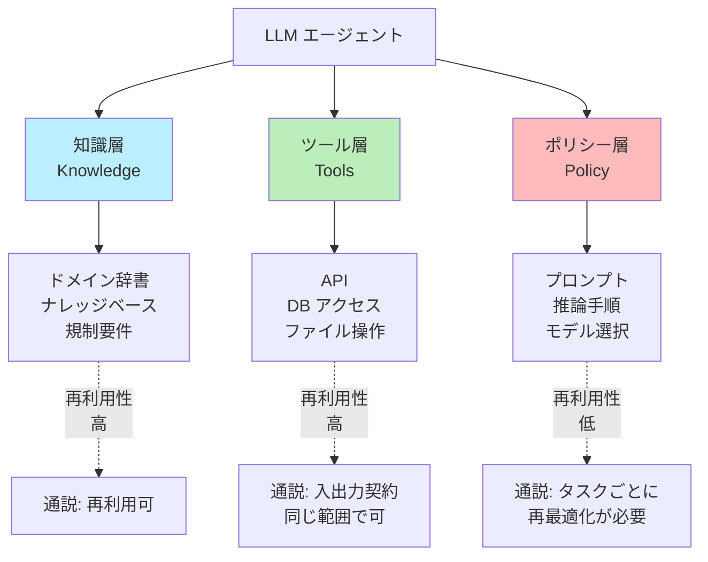
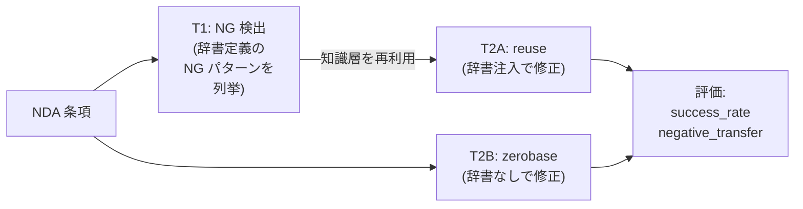
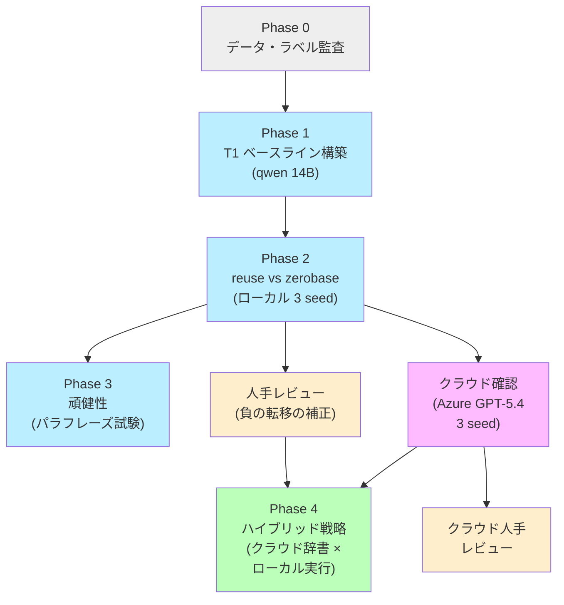
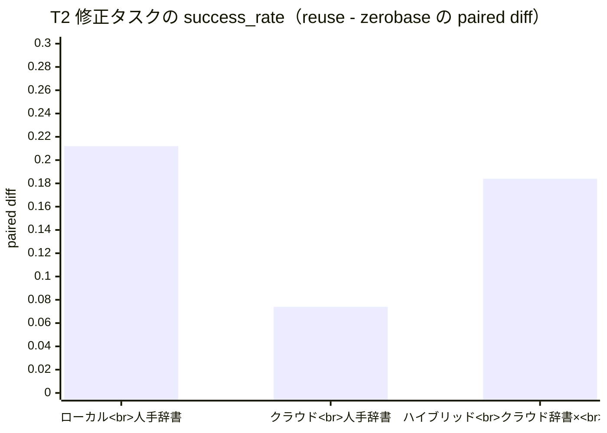
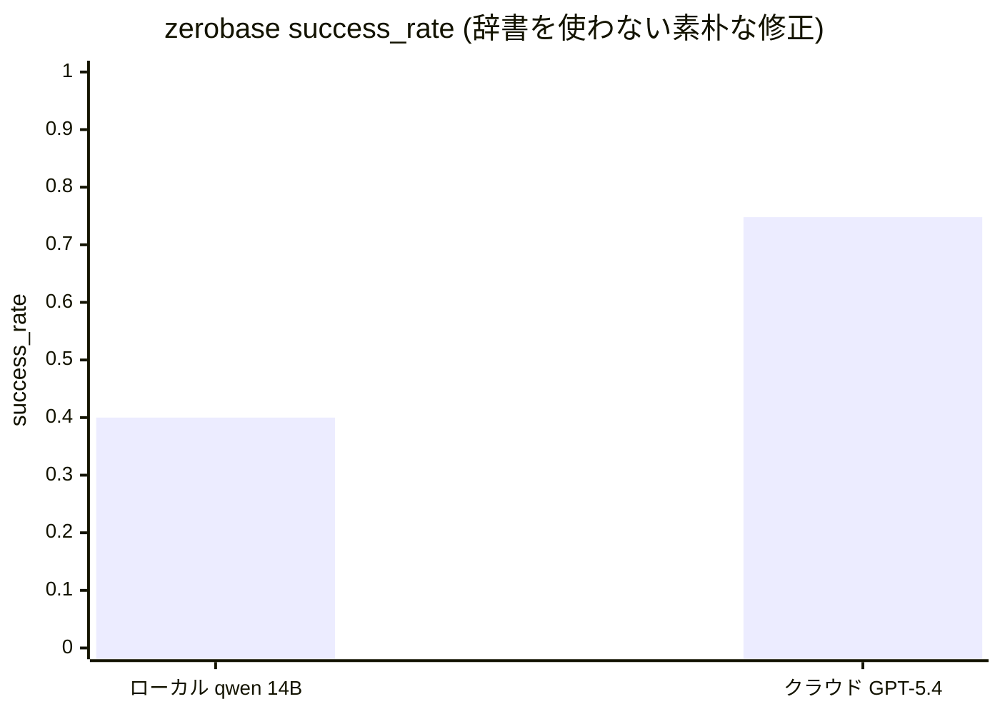
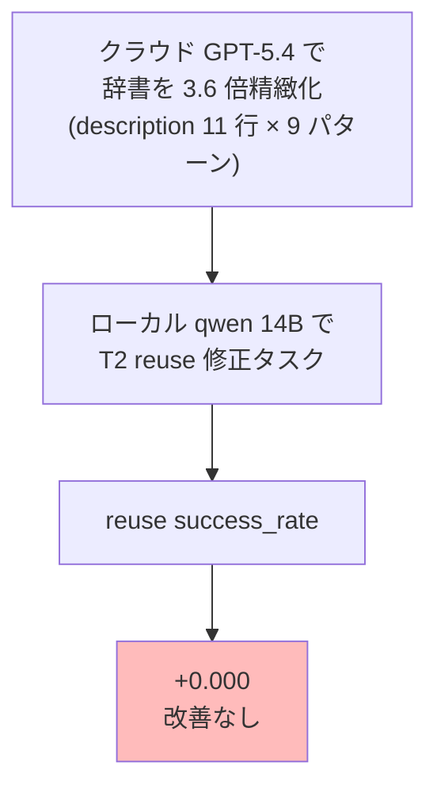
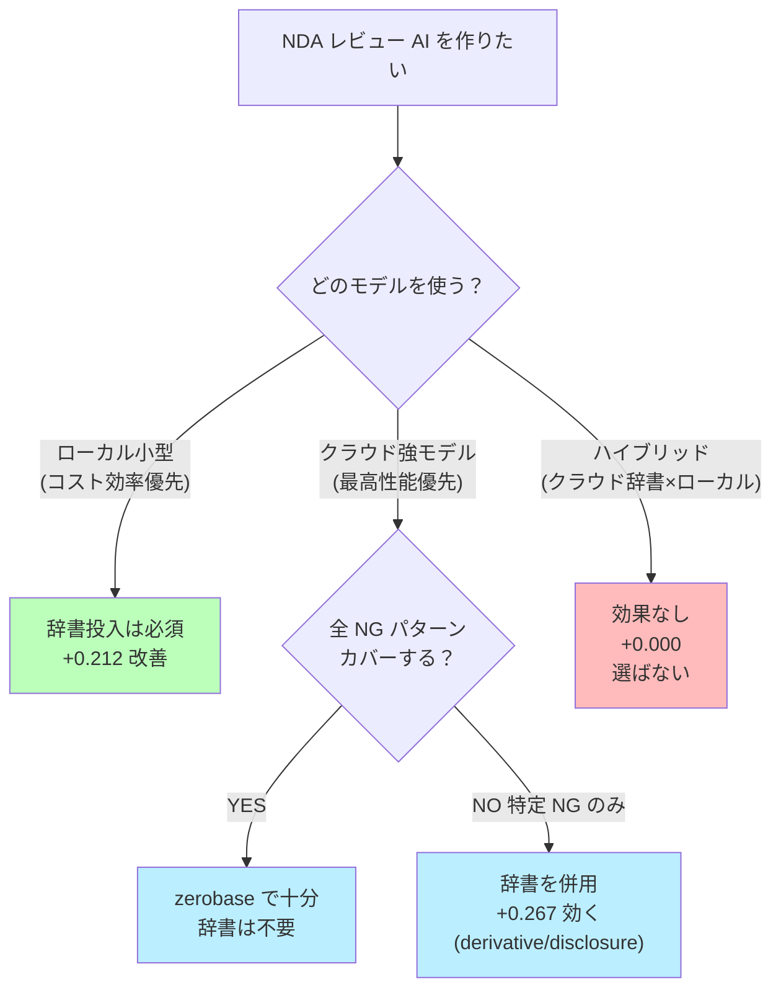

> **Part 1（本記事）**: 検証の背景・問い・結論・実装者への含意
> **[Part 2](#)**: 検証の詳細実装と失敗ルート、コード <!-- TODO: 公開後 Part 2 の Zenn URL に置換 -->

LLM エージェント（Agentic AI）の世界では「**知識層（ドメイン辞書）は別タスクへ再利用できる**」という直感が広く共有されています。Voyager のスキルライブラリ、AgentSquare のモジュール再利用、Agent Skills 標準など、多くの研究がこの方向を示唆しています。

でも、本当にそれは **実務ドメイン** で **どのモデルでも** 効くのでしょうか？

本検証では NDA（秘密保持契約）レビューを題材に、**ローカル LLM (Qwen 2.5 14B)** と **クラウド強モデル (Azure GPT-5.4)** で実測しました。結論を一言でいうと:

> **モデル能力 > 知識層の品質 > 知識層の構造**

辞書を高品質化しても、モデル能力の天井は破れない。これが本検証で繰り返し観測された非対称性です。

## 先に結論（6 行で読む全体像）

| 観点 | 結果（数値） | 言葉で言うと |
| --- | --- | --- |
| 仮説 | 知識層（ドメイン辞書）は別タスクへ再利用できる | 一度作った辞書を別タスクで使い回したい |
| ローカル qwen 2.5 14B + 人手辞書 | paired diff **+0.212**、8/9 パターンで再利用優位 | **辞書ありの方がはっきり強い**（辞書なしより 21 ポイント多く成功） |
| クラウド Azure GPT-5.4 + 人手辞書 | paired diff **+0.074**、95% CI が 0 を含む | **差は小さく、統計的には有意と言えない**（強モデルは辞書なしでも十分強い） |
| ハイブリッド (クラウド辞書 × ローカル実行) | reuse 改善 **+0.000**、知識層の品質では天井破れず | **辞書をどれだけ高品質化しても、弱モデルの限界は超えられない** |
| 真の負の転移率（人手レビュー後） | 両モデルで **≒ 0** | **辞書を入れたせいで新たに悪化したケースは実質ゼロ** |
| 含意 | 弱モデルでは強く効く、強モデルでは限定的、辞書だけでは能力差を埋められない | **モデル能力の差を辞書だけで埋めようとしてはいけない** |

## この記事で扱うこと（検索ニーズへの即答）

| よくある問い | 本記事の答え |
| --- | --- |
| LLM エージェントの「コンポーネント再利用」は本当に効くのか？ | 弱モデルで +0.212、強モデルで +0.074 |
| 知識層 (ドメイン辞書) は別タスクへ流用できるか？ | YES。ただし効果はモデル能力で減衰 |
| 負の転移は起きるか？ | 観測値は出るが大半は評価器 FP、**真の値はゼロ** |
| ローカル LLM とクラウド強モデルで結果は同じか？ | NO。**クラウドでの最終確認は必須** |
| 1 seed の結果だけで結論できるか？ | NO。GPT-5.4 で seed=42 単発だと「再利用消失」と誤判定する罠を実体験 |
| クラウドで辞書を作ればローカルでも強モデル並みになるか？ | **NO**。reuse +0.000、ローカルの天井は知識層の品質ではなくモデル能力 |
| 辞書 vs プロンプト改善、どちらに投資すべき？ | **弱モデル運用なら辞書、強モデル運用ならハイブリッド** |

---

## 1. なぜ「知識層再利用」が論点なのか

LLM エージェントを毎タスク・毎プロジェクトでゼロから組むのは無駄が大きい。同じドメインの類似タスクで「何が再利用できて、何が再利用できないのか」が分かれば、開発工数を大幅に削減できます。

最近の Agentic AI 系研究（Voyager、AgentSquare、AFlow、ADAS、Skill-Pro など）の整理から、エージェントは大きく **3 層に分けて議論される**ことが多いです。

**未検証だったこと**: 知識層再利用が **実務ドメイン** で **本当に効くのか**、そして **モデル能力に依存しないのか**。

本検証は、ここに 1 つの実測データを足すことが目的です。

## 2. 当初の中核仮説

検証の出発点となった仮説は以下です。本検証では **T1 = NG 条項の「検出」タスク**、**T2 = NG 条項の「修正」タスク** を指します（タスクの詳細は §3.1 で説明）。

> 同一ドメイン内の関連タスク T1, T2 において、
> T1 で構築した知識層（ドメイン辞書）を T2 に注入すると、
> T2 をゼロベース構築するより **コールドスタート工数を削減し、最終スコアを劣化させず、負の転移を起こさない**。

イメージとしては、「**契約レビュー AI のチーム A が作った『NG 条項リスト』を、チーム B の『条項修正 AI』にそのまま渡せば、ゼロから作るより速く・正確になるはず**」という直感です。

この仮説を測るため、本検証では T2 修正タスクを **2 つの条件で対照比較** します。以降の表・本文で繰り返し登場する用語なので、ここで定義しておきます:

| 条件名 | 内容 | 一言で |
| --- | --- | --- |
| **reuse** | T1 で作った NG パターン辞書を T2 のプロンプトに **そのまま注入** して修正させる | **「辞書を再利用する」側** |
| **zerobase** | 辞書を渡さず、「NDA として不適切な部分を直して」という抽象指示だけで修正させる | **「ゼロから組む」側（対照群）** |

合格条件は **「reuse が zerobase に対して優位かどうか」** で判定します。

### 当初の合格条件（実験前に固定）

| 条件 | 合格基準 |
| --- | --- |
| 1. コールドスタート工数の削減 | reuse が zerobase より構築時間・反復回数を有意に減らす |
| 2. 最終スコアを劣化させない | reuse の最終スコアが zerobase 以上 |
| 3. 負の転移が出ない | reuse で「元になかった NG」が新規発生しない |

3 つすべて達成で仮説確認、いずれか不達成なら **そのドメイン・タスク対では再利用前提が成立しない** という明確な結論を出す、という設計です。

## 3. 検証設計

### 3.1 タスク（NDA ドメイン）

| | 内容 |
| --- | --- |
| T1: NG 条項検出 | 与えられた契約条項に、辞書定義された NG パターンが含まれるかを列挙 |
| T2: NG 条項修正 | NG が含まれる条項を最小変更でリライト |
| 関係 | T1 で「何が NG か」が定義されていれば、T2 で「どう直すか」に再利用できるはず |

### 3.2 NG パターン辞書（9 種類）

中小企業庁 NDA 雛形を元に 9 種類の NG パターンを定義しました。

| ID | 内容 | 型 |
| --- | --- | --- |
| nda_scope_overbroad | 秘密情報の範囲過大 | 明示型 |
| nda_duration_unbounded | 秘密保持期間の無期限 | 明示型 |
| nda_purpose_undefined | 利用目的の不明確 | 明示型 |
| nda_disclosure_exception_missing | 開示例外不在 | 欠落型 |
| nda_remedy_imbalanced | 損害賠償の不均衡 | 明示型 |
| nda_jurisdiction_one_sided | 管轄の一方的指定 | 明示型 |
| nda_return_destroy_missing | 返還・廃棄義務の不在 | 欠落型 |
| nda_derivative_undefined | 派生情報の取扱い未定義 | 欠落型 |
| nda_survival_missing | 存続条項の欠落 | 欠落型 |

### 3.3 検証フェーズ

## 4. 主要結果

### 4.1 4 軸の最終スコア

| 評価軸 | paired diff | 95% CI | 判定 |
| --- | --- | --- | --- |
| **ローカル + 人手辞書** (Phase 2) | **+0.212** | CI 0 を含まず | **強く支持** |
| **クラウド + 人手辞書** (Phase 2 Azure) | **+0.074** | CI [-0.095, +0.243] | **弱く支持** |
| **ハイブリッド** (Phase 4) | **+0.184** | seed=42 単発 | T2 改善は -0.002 |
| **頑健性** (Phase 3、パラフレーズ) | +0.166 (v0.1.0→v0.1.1) | - | 正方向維持 |

### 4.2 zerobase の絶対性能が劇的に違う

| variant | ローカル qwen 14B | クラウド GPT-5.4 | 差 |
| --- | --- | --- | --- |
| reuse | 0.612 | 0.822 | +0.210 |
| **zerobase** | **0.400** | **0.748** | **+0.348** |

zerobase が +0.348 と劇的に伸びた一方、reuse の伸びは半分以下。これが **「強モデルでは辞書の追加価値が縮小」** の数値根拠です。

### 4.3 per-pattern: 強モデルでも辞書が効くパターンがある

| pattern_id | クラウド reuse | クラウド zerobase | 差 |
| --- | --- | --- | --- |
| nda_scope_overbroad | 1.000 | 1.000 | 0.000 |
| nda_derivative_undefined | 0.667 | 0.400 | **+0.267** |
| nda_disclosure_exception_missing | 0.933 | 0.667 | **+0.267** |
| nda_jurisdiction_one_sided | 0.667 | 0.533 | +0.133 |
| nda_purpose_undefined | 0.733 | 0.600 | +0.133 |
| nda_remedy_imbalanced | 0.867 | 0.867 | 0.000 |
| nda_duration_unbounded | 0.800 | 0.933 | -0.133 |

**強モデルでも `nda_derivative_undefined` `nda_disclosure_exception_missing` のような「意味的に細かい NG」では辞書が +0.267 効く**。一方、明示的な NG（`scope_overbroad` 等）は zerobase でも完璧。

### 4.4 負の転移は「観測される」が「真の値はゼロ」

| | 観測 negative_transfer_rate | 人手レビュー後の真の値 |
| --- | --- | --- |
| ローカル reuse | 0.769 | **≒ 0** |
| クラウド reuse | 0.407 ± 0.068 | **≒ 0** |

20 件の人手レビューで判明:

| 判定 | ローカル qwen | クラウド GPT-5.4 |
| --- | --- | --- |
| T（真の負の転移） | 0 / 27 (0.0%) | 0 / 20 (0.0%) |
| F（評価器 FP） | 22 / 27 (81.5%) | 10 / 20 (50.0%) |
| ?（保留・元から残存） | 5 / 27 (18.5%) | 10 / 20 (50.0%) |

→ **観測された負の転移率の大半は T1 検出器の False Positive**。人手レビューで補正することで、結論を「仮説不支持」から「条件付き支持」に書き換えました。

### 4.5 ハイブリッドの裏切り（私の予想が外れた話）

「クラウド強モデルで作った辞書をローカル弱モデルで使えば、強モデル並みの性能が出るのでは？」という自然な仮説を検証したのが **Phase 4** です。

私の事前予測:

| シナリオ | 私の推測 |
| --- | --- |
| ローカル + 人手辞書 (実測) | 0.612 |
| ローカル + クラウド辞書 | **0.65 - 0.75 と推測** |
| クラウド + 人手辞書 (実測) | 0.822 |

実際の結果:

| 指標 | ローカル + 人手辞書 | **ローカル + クラウド辞書** | 差 |
| --- | --- | --- | --- |
| reuse success | 0.550 | **0.548** | **-0.002** |
| zerobase success | 0.289 | 0.364 | +0.075 |

**reuse success_rate は変化なし (-0.002)**。私の推測は完全に外れました。

ローカル弱モデルの天井は **知識層の品質ではなくテキスト理解・生成能力にある** ことが、この一発で実証されました。

## 5. 結論

### 5.1 仮説に対する判定（4 段階で評価）

| 評価軸 | 結果 |
| --- | --- |
| 弱モデル運用での再利用優位 | **強く支持** (paired diff +0.212, 全 seed 正方向) |
| 強モデル運用での再利用優位 | **弱く支持** (paired diff +0.074, CI 0 含む) |
| 真の負の転移なし | **両モデルで支持** (人手レビュー後 ≒ 0) |
| クラウド辞書 × ローカル実行で性能改善 | **不支持** (reuse +0.000) |
| モデル能力依存 | **強い**（強モデルでは zerobase が +0.348 向上） |

### 5.2 実装者への含意: 投資先の判断マトリクス

| 運用シナリオ | 知識層再利用の価値 |
| --- | --- |
| ローカル小型モデル | **必須**。zerobase が 0.289 で壊滅、辞書投入で 0.612 まで救済 |
| クラウド強モデル（汎用） | **補助的**。zerobase で 0.748 達成、辞書投入の追加価値は小 |
| クラウド強モデル × 特定 NG のみ | **YES**。意味的に細かい NG では +0.267 効く |
| ハイブリッド | **NO**。知識層の品質ではローカルの天井破れず |
| 教育・説明可能性 | **常に有用**。「何が NG か」を人間と共有する仕組みとして |

### 5.3 検証全体の最終結論を一文で

> **知識層再利用は弱モデルの能力補完として強く効く (+0.212)。
> 強モデルでは zerobase 自身が高性能になるため相対的価値は縮小 (+0.074)。
> 知識層の品質を上げてもローカル弱モデルの天井は破れない (+0.000)。
> 「モデル能力 > 知識層の品質」 という非対称性が、本検証で繰り返し観測された。**

## 6. 検証から得た 5 つの実装知見

| 知見 | ひとこと要約 |
| --- | --- |
| 1. 単発の好スコアで判定しない | seed=42 単発だと paired diff = 0.000、3 seed で +0.074。1 seed 結論は危険 |
| 2. 評価器の FP は人手レビューで補正 | 観測 negative_transfer 0.769 → 真の値 ≒ 0。LLM-as-judge の品質確認は必須 |
| 3. 失敗ルートを記録する | P4 (Few-shot) / P5-A (機械照合) / Phase 4 (ハイブリッド) で 3 連続廃案、その理由が次の学習 |
| 4. プロバイダ非依存の設定層は最初から作る | `.env` で ollama → Azure OpenAI 切替、1 日でクラウド確認完了 |
| 5. モデル能力 > 知識層の品質 という非対称性 | 辞書 3.6 倍精緻化しても reuse +0.000、天井はモデル側にある |

## 7. 何をしなかったか（制約）

| 制約 | 内容 |
| --- | --- |
| ドメイン | NDA のみ。業務委託、ライセンス、利用規約等への横展開は未確認 |
| サンプル数 | 1 seed あたり 45 sample。3 seed で 95% CI 幅は依然広い |
| 評価指標の偏り | NG Recall 主軸。修正テキストの「法務的に妥当か」は別評価器が必要 |
| reasoning モデルの再現性 | GPT-5.4 は temperature 1.0 固定、seed 不可。完全再現は不可 |
| 知識層の構造の多様性 | NG/OK 対照スロット型、T1/T2 分離型などは未検証（続編で扱う予定） |

## 8. 続編予告: 実装編で扱うこと

Part 2 では以下を詳しく扱います。**「コードと数字でどう検証したか」**を知りたい方向け。

- 各 Phase の実装詳細（評価器、合成器、検出器、修正器、評価指標）
- T1 検出器の改善履歴（v0.1.0 → v0.3.0 まで 3 回反復）
- P4 / P5-A で「失敗した改善案」とその学び
- Azure OpenAI 移植の実装（プロバイダ非依存設定層、reasoning モデル対応）
- ollama context size 拡張（Modelfile カスタムモデル）
- 人手レビューの workflow
- MLflow 実験管理の活用
- 再現可能なコードベース構造

[Part 2: 実装編 →](#) <!-- TODO: 公開後 Part 2 の Zenn URL に置換 -->

## 9. 参考文献・関連 OSS

| 名称 | 役割 | 出典 |
| --- | --- | --- |
| Voyager | スキルライブラリ・パラダイムの原典 | voyager.minedojo.org |
| AFlow | ワークフロー自動探索 (MCTS) | arXiv:2410.10762 |
| AgentSquare | モジュール探索空間 | arXiv:2410.06153 |
| DSPy + MIPROv2 | 評価駆動のプロンプト最適化 | github.com/stanfordnlp/dspy |
| Skill-Pro | スキル再利用率・性能評価 | arXiv:2602.01869 |
| Agent Skills 標準 | 可搬な Markdown スキルファイル | arXiv:2603.16112 |
| MLflow | 実験管理 | mlflow.org |

法務分野:
- 経済産業省「秘密情報の保護ハンドブック」
- 経済産業省 営業秘密管理指針
- JIPDEC 秘密情報の取扱いに関するガイドブック
- 不正競争防止法 2 条 6 項

## 10. 著者からの注記

本記事は実検証ログのまとめです。**「教科書通り」の検証結果でも、実際に手を動かして数字で殴られると重みが違う**、というのが正直な感想です。

Agentic AI / LLM エージェント自動生成 / リーガルテック AI に取り組む方の参考になれば幸いです。

続編 Part 2 では実装の詳細とコードを公開します。「自分のドメインで再現したい」「失敗ルートが知りたい」という方は Part 2 もご覧ください。
