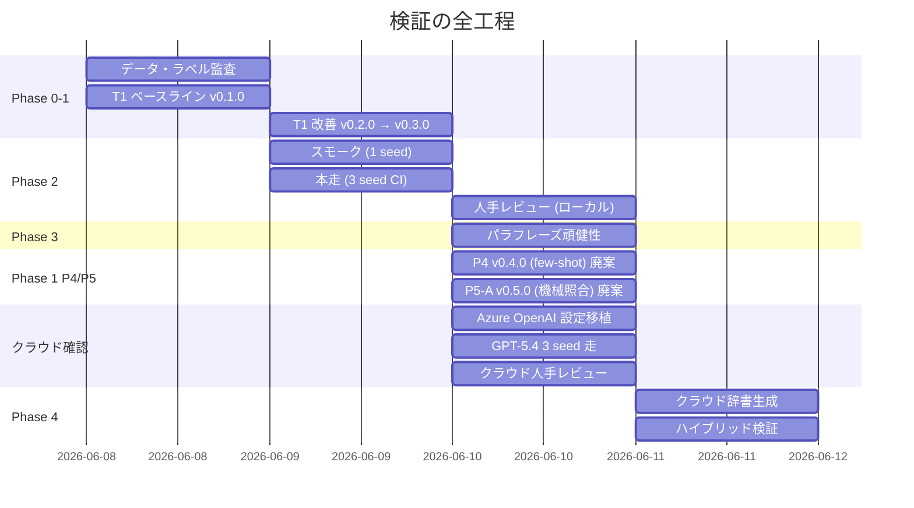
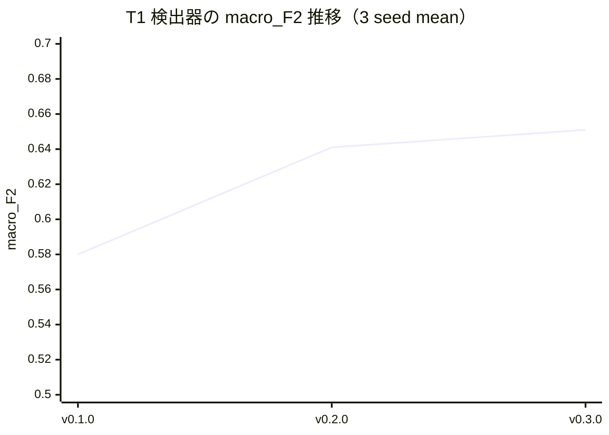
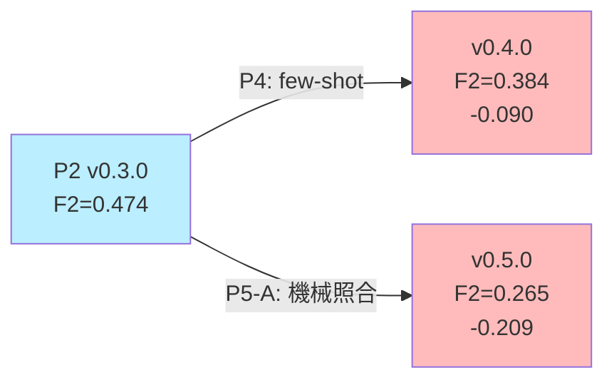
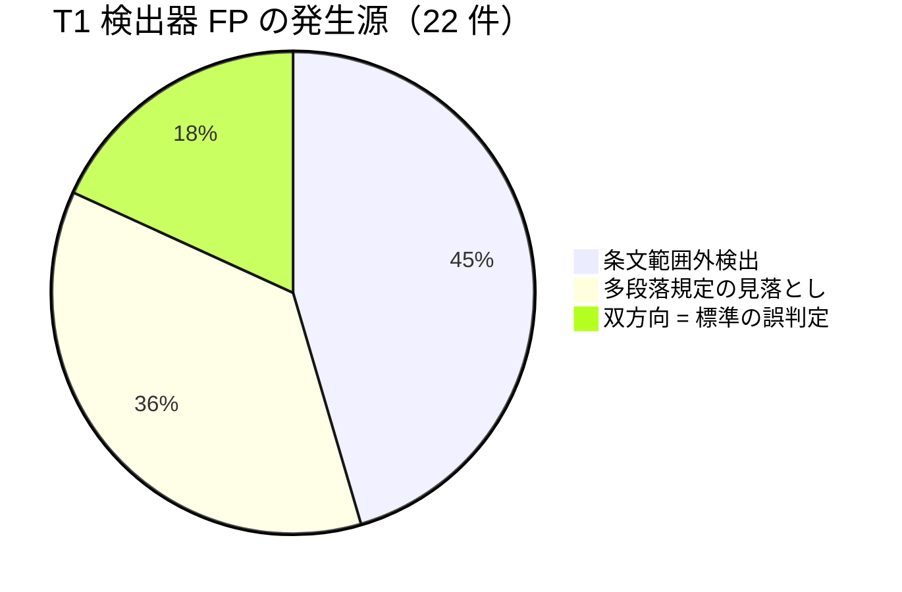
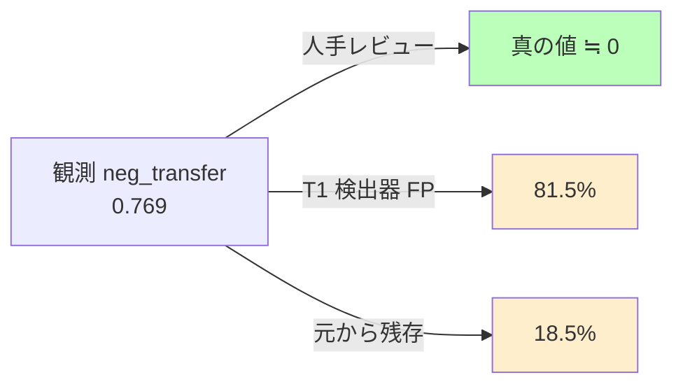
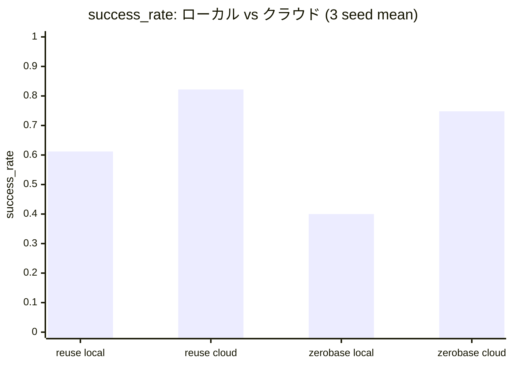
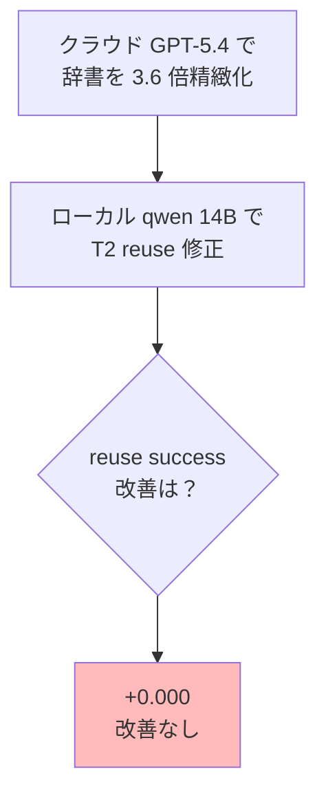
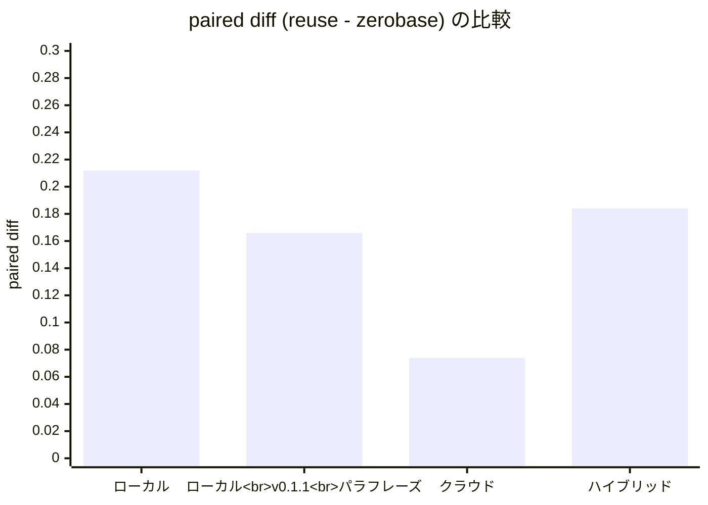

> **[Part 1](#)**: 検証の背景・問い・結論・実装者への含意 <!-- TODO: 公開後 Part 1 の Zenn URL に置換 -->
> **Part 2（本記事）**: 検証の詳細実装と失敗ルート、コード

[Part 1（結論編）](#) <!-- TODO: 公開後 Part 1 の Zenn URL に置換 --> で「**モデル能力 > 知識層の品質 > 知識層の構造**」という結論をお伝えしました。本記事は **「コードと数字でどう検証したか」** の実装ログです。

実際に手を動かす中で、3 つの大きな失敗ルートに当たりました。「うまくいかなかった理由」を残すことが次の試行への学習だと考えて、それも記録します。

## 0. 検証全体のフェーズ構成



## 1. プロジェクト構造とツール選定

### 1.1 リポジトリ構成

```
src/tsumiki/
  baseline/        # T1 検出器、T2 修正器
    ng_detector.py
    ng_modifier.py
  data/            # 合成器、データパイプライン
    pipeline.py
    synthesis.py
  eval/            # 評価指標
    labels.py
    metrics.py
    modification.py
  knowledge/       # NG パターン辞書 (YAML)
    nda/ng_patterns.yaml
  llm/             # プロバイダ非依存の設定層
    client.py
  runner/          # Phase 1/2 Runner
    phase1.py
    phase2.py

experiments/       # CLI スクリプト
  build_clean_clauses.py
  run_phase1_dryrun.py
  run_phase2_dryrun.py
  aggregate_phase1_seeds.py
  aggregate_phase2_seeds.py
  aggregate_phase3_robustness.py
  extract_negative_transfer_review.py
  generate_hybrid_dictionary.py

docs/experiments/  # 各 Phase の結果ドキュメント
```

### 1.2 技術スタック

| 項目 | 選定 |
| --- | --- |
| 言語 | Python 3.13 |
| 依存管理 | uv（uv.lock 駆動の厳密インストール） |
| LLM (ローカル) | Qwen 2.5 14B Instruct (Q4_K_M, GGUF) on ollama |
| LLM (クラウド) | Azure OpenAI GPT-5.4 |
| 実験記録 | MLflow（file backend） |
| データ | 中小企業庁 NDA 雛形 (`guideline02.docx`) |
| プロンプト管理 | SemVer (`baseline.v0.1.0` → `v0.3.0`) |
| 知識資産 | YAML (`ng_patterns.yaml`)、SemVer 管理 |
| 統計 | scipy.stats で t 分布 CI |

### 1.3 LLM 抽象化レイヤー

複数プロバイダを切替可能にするため、**プロバイダ非依存の設定層**を最初から作りました。

```python
# src/tsumiki/llm/client.py
from openai import AzureOpenAI, OpenAI

@dataclass(frozen=True)
class LLMSettings:
    provider: Literal["openai_compatible", "azure_openai"]
    base_url: str
    api_key: str
    model: str
    temperature: float = 0.0
    api_version: str = ""  # azure_openai でのみ意味を持つ

    @classmethod
    def from_env(cls) -> LLMSettings:
        # LLM_PROVIDER で分岐
        ...

def build_client(settings: LLMSettings) -> OpenAI | AzureOpenAI:
    if settings.provider == "azure_openai":
        return AzureOpenAI(
            azure_endpoint=settings.base_url,
            api_key=settings.api_key,
            api_version=settings.api_version,
        )
    return OpenAI(base_url=settings.base_url, api_key=settings.api_key)
```

これと `.env` の組み合わせで、**ローカル ollama ↔ Azure OpenAI を 1 行の書き換えで切替できる**ようにしました。後でクラウド確認時、これが大きく効きました。

## 2. Phase 0 - データ・ラベル監査

### 2.1 データソース

中小企業庁の「秘密保持契約書ガイドライン」付属の NDA 雛形 (`guideline02.docx`) を 1 つだけ使いました。法務ドメインでは「ひな型ベースで合成データを作る」のが現実的です。

### 2.2 条項抽出のパイプライン

```python
# src/tsumiki/data/pipeline.py
_MIN_CLAUSE_LEN: int = 50  # 署名欄や見出しを除外
_OPTION_MARKERS: tuple[str, ...] = ("■■オプション条項", "■■オプション", "■■代替")

def _sanitize_text(text: str) -> str:
    out = text.replace("\t", " ")  # llama-server がタブで 500 を返すバグ回避
    out = re.sub(r"\n{3,}", "\n\n", out)
    return out.strip()
```

**実装上のハマりどころ**:
1. **署名欄が条項として抽出される** → `_MIN_CLAUSE_LEN=50` でフィルタ
2. **オプション条項（雛形上の選択肢）が混入** → マーカーで除外
3. **タブ文字でローカル LLM が 500 エラー** → サニタイズで除去

### 2.3 NG パターン辞書

9 種類の NG パターンを YAML で定義。各パターンに `description`（3 セクション: 検出すべき / 紛らわしい / 対象条項）、`severity`、`references`、`applicable_topics` を持たせています。

```yaml
- id: nda_scope_overbroad
  name: 秘密情報の範囲過大
  description: |
    検出すべき: 秘密情報の定義条項に「一切の情報」「全ての情報」のような無限定範囲、
    または既知情報・公知情報・第三者からの正当取得情報の除外規定が無い。
    紛らわしい: 厳格な秘密指定手続と除外規定が定義条項に明示されている場合は該当しない。
    対象条項: 「秘密情報」「定義」を主題とする条項のみが判定対象。
  applicable_topics: [definition]
  excerpt_examples:
    - "本契約において「秘密情報」とは、開示当事者から受領当事者に対して開示された一切の情報をいう。"
  severity: high
  references:
    - 経済産業省 営業秘密管理指針
```

## 3. Phase 1 - T1 検出器の構築と改善履歴

### 3.1 評価指標

NG Recall を主指標、Precision を補助、合成して macro_F2（β=2、Recall 重視）。

```python
# src/tsumiki/eval/metrics.py
def compute_metrics(labels, predictions, pattern_ids):
    # per-pattern の precision / recall / F2 を集計
    # 全体の macro 平均と weighted 平均を返す
    ...
```

### 3.2 T1 プロンプト改善履歴

| 反復 | TEST macro_recall | TEST macro_precision | TEST macro_F2 |
| --- | --- | --- | --- |
| v0.1.0 (素朴) | 0.648 ± 0.085 | 0.472 ± 0.083 | 0.580 ± 0.084 |
| v0.2.0 (欠落型明示) | 0.778 ± 0.056 | 0.478 ± 0.053 | 0.641 ± 0.046 |
| **v0.3.0 (厳格判定)** | **0.722 ± 0.056** | **0.533 ± 0.050** | **0.651 ± 0.047** |



v0.2.0 → v0.3.0 で **(a)(b)(c) の厳格な判定条件** を追加:

```
## 欠落型の列挙条件
以下の (a)(b)(c) すべて を満たす場合のみ列挙する:
(a) 条項の主題と当該欠落 NG の対象範囲が **直接的に関連** する
(b) 該当規定への **明示的な言及が見当たらない**
(c) 「黙示」「他条項で扱う可能性」等の **推測解釈をしない**
```

これで **精度 +0.055 を獲得し、v0.3.0 を確定ベースライン (P2)** としました。

### 3.3 失敗ルート 1: P4 v0.4.0 (Few-shot 3 例)

Phase 2 人手レビューで T1 検出器の FP（条文範囲外検出、多段落見落とし、双方向誤判定）が判明。これを直すため few-shot 3 例を追加した v0.4.0 を試しました。

```
# 例 1: 知的財産権条項 vs 派生情報未定義
対象条項主題: 知的財産権
パターン nda_derivative_undefined の対象条項: 「定義」「知的財産権」「成果物」
→ 主題は対象条項に含まれる。ただし条項本文に「発明等」「特許」等の知財規定がある場合、
   それは派生情報の規定**ではない**。派生情報・分析結果・成果物への明示的言及が無く、
   かつ「派生情報」自体が条項の主題でない場合は **列挙しない**。
```

結果は **失敗**:

| 指標 | v0.3.0 | v0.4.0 | 差 |
| --- | --- | --- | --- |
| macro_recall | 0.556 | 0.444 | -0.112 |
| macro_precision | 0.352 | 0.306 | -0.046 |
| **macro_F2** | **0.474** | **0.384** | **-0.090** |

**学び**:
- few-shot で「列挙する例」と「列挙しない例」を混ぜると判定が振れる
- 明示型 jurisdiction の recall を完全に失った（「確信無きは列挙しない」が明示型にも作用、強すぎた）
- few-shot 例 1 の「主題は対象条項に含まれる。ただし…」が振れの源

### 3.4 失敗ルート 2: P5-A v0.5.0 (機械的トピック照合)

辞書 v0.3.0 に **`applicable_topics`** という machine-readable な構造化フィールドを追加し、プロンプトで機械的にトピック照合する案を試しました。

```yaml
- id: nda_jurisdiction_one_sided
  applicable_topics: [jurisdiction]
- id: nda_derivative_undefined
  applicable_topics: [definition, intellectual_property, deliverable]
```

プロンプトは **構造化 4 ステップ**:
```
## ステップ 1: 対象条項の主題を 1 つだけ選ぶ
## ステップ 2: パターンの applicable_topics と照合
## ステップ 3: 残ったパターンに (a)(b)(c) を適用
## ステップ 4: 確信を持てない場合は列挙しない
```

結果は **大失敗**:

| 指標 | v0.3.0 | v0.5.0 | 差 |
| --- | --- | --- | --- |
| macro_recall | 0.556 | 0.333 | **-0.223** |
| macro_precision | 0.352 | 0.148 | **-0.204** |
| **macro_F2** | **0.474** | **0.265** | **-0.209** |

**致命的悪化**:
- jurisdiction の recall を完全に失った（明示型なのに 0）
- derivative の recall も失った（P4 では維持できていた）

**学び**: 機械的 hard filter は「**LLM の主題判定が 1 つでもミスると recall を連鎖的に失う**」脆弱性がある。一部 FP は削減できたが、副作用が支配的。



T1 改良路線で 2 連敗。ここで **「v0.3.0 を維持して Phase 2/3 を進める」** と判断しました。

## 4. Phase 2 - reuse vs zerobase 対照実験

### 4.1 T2 修正プロンプトの 2 variant

```python
# src/tsumiki/baseline/ng_modifier.py
_PROMPT_REUSE_V0_1_0 = """あなたは NDA の条項を改善する担当です。
以下の条項案には指定された NG パターンが含まれています。
当該 NG パターンが除去されるように、条項を最小限の変更で修正してください。

# 取り除くべき NG パターン
{target_block}

# 参考: NG パターン定義（取り除く際の判断基準）
{patterns_block}

# 元条項
{clause_text}
"""

_PROMPT_ZEROBASE_V0_1_0 = """あなたは NDA の条項を改善する担当です。
以下の条項案には不適切な部分があります。NDA として不適切な部分を修正してください。

# 元条項
{clause_text}
"""
```

差は明確: **reuse は NG パターン辞書を全文展開**、**zerobase は抽象指示のみ**。

### 4.2 評価器の設計

```python
# src/tsumiki/eval/modification.py
@dataclass(frozen=True)
class ModificationOutcome:
    sample_id: str
    original_text: str
    truth_pattern_ids: frozenset[str]  # 元の NG
    modified_text: str
    detected_after: frozenset[str]      # 修正後に T1 検出器が検出した NG
    target_removed: bool                # truth NG が消えたか
    new_ng_introduced: bool             # 元になかった NG が出たか
```

| 指標 | 定義 |
| --- | --- |
| modification_success_rate | target_removed=True の割合 |
| negative_transfer_rate | new_ng_introduced=True の割合 |

### 4.3 3 seed 結果（ローカル qwen 14B）

| variant | success_rate | 95% CI | negative_transfer |
| --- | --- | --- | --- |
| reuse | 0.612 ± 0.098 | [0.368, 0.855] | 0.769 ± 0.076 |
| zerobase | 0.400 ± 0.102 | [0.147, 0.652] | 0.520 ± 0.080 |
| **paired diff** | **+0.212** | - | +0.249 |

per-pattern では **8/9 パターンで reuse 優位**。

### 4.4 「負の転移」観測値は本物か？

paired diff +0.249 の negative_transfer は 95% CI [+0.015, +0.482] で **0 を含まず統計的に有意**。これだけ見ると「reuse は負の転移を起こす」と読めます。

そこで **人手レビュー** を実施。reuse の `new_ng_introduced=True` サンプルから 20 件を抽出し、私（Claude）が各「新規検出 NG」を **真の負の転移 (T)** か **T1 検出器の FP (F)** か判定:

| 判定 | 件数 | 率 |
| --- | --- | --- |
| **T (真の負の転移)** | **0** | **0.0%** |
| F (T1 検出器 FP) | 22 | 81.5% |
| ? (保留・元から残存) | 5 | 18.5% |

**真の負の転移率はゼロ**。観測値の大半は T1 検出器の FP でした。

FP の主要パターン:





この結果で **「仮説不支持」から「条件付き支持」に書き換え** ました。

## 5. Phase 3 - パラフレーズ頑健性

### 5.1 設計

T2 修正プロンプトの **言い換え版 v0.1.1** を作り、文体・順序・接続詞を変えつつ意味は保ちました。

```python
# reuse v0.1.0 → v0.1.1
# 「あなたは ~ 担当」 → 「次の業務を担当してください」
# 「# 制約」 → 「リライトにあたっての守るべき条件」
# 「# 元条項」 → 「【リライト対象の条項】」
```

### 5.2 結果

| 指標 | v0.1.0 | v0.1.1 | 差 |
| --- | --- | --- | --- |
| reuse success | 0.550 | 0.455 | -0.095 |
| zerobase success | 0.289 | 0.289 | ±0.000 |
| paired diff | +0.261 | +0.166 | -0.095 |

reuse は ±0.1 ぎりぎりで変動、zerobase は完全安定。**paired diff は正方向維持** で Phase 3 ゲートクリア。

per-pattern では、reuse 側の明示型 NG が大きく揺らぐパターンが見えました:

| pattern | 変化 |
| --- | --- |
| jurisdiction_one_sided | -0.500 (大幅悪化) |
| disclosure_exception_missing | -0.400 (大幅悪化) |
| survival_missing | +0.350 (大幅改善) |

辞書を参照する LLM の挙動が **プロンプト文体に敏感** であることが分かりました。

## 6. クラウド確認 - Azure OpenAI GPT-5.4 移植

### 6.1 プロバイダ非依存設定の活用

`.env` を切り替えるだけでクラウドへ移植できる構造にしてあったので、移植自体は **1 日で完了**:

```dotenv
# 旧（ローカル ollama）
# LLM_PROVIDER=openai_compatible
# LLM_BASE_URL=http://localhost:11434/v1
# LLM_API_KEY=ollama
# LLM_MODEL=hf.co/bartowski/Qwen2.5-14B-Instruct-GGUF:Q4_K_M

# 新（Azure OpenAI GPT-5.4）
LLM_PROVIDER=azure_openai
AZURE_OPENAI_ENDPOINT=https://<resource>.openai.azure.com/
AZURE_OPENAI_API_KEY=<key>
AZURE_OPENAI_DEPLOYMENT=gpt-5.4
AZURE_OPENAI_API_VERSION=2024-12-01-preview
```

### 6.2 ハマりポイント: reasoning モデル仕様差分

GPT-5 / o1 / o3 系列の reasoning モデルは API 仕様が違いました:

| 項目 | 通常モデル | reasoning モデル (GPT-5.4) |
| --- | --- | --- |
| 出力上限指定 | `max_tokens` | **`max_completion_tokens`** |
| temperature | 0.0 可 | **1.0 固定** |
| seed | 反映される | **受け付けない** |

対応:

```python
# src/tsumiki/data/synthesis.py
def is_reasoning_model(model: str) -> bool:
    name = model.lower()
    return (
        name.startswith("o1") or name.startswith("o3") or name.startswith("o4")
        or "gpt-5" in name or "gpt-6" in name
    )

def make_openai_chat_fn(client, model, temperature, seed, max_completion_tokens=4096):
    reasoning = is_reasoning_model(model)
    def call(prompt):
        kwargs = {"model": model, "messages": [{"role": "user", "content": prompt}]}
        if reasoning:
            kwargs["max_completion_tokens"] = max_completion_tokens
            # temperature/seed は送らない
        else:
            kwargs["temperature"] = temperature
            kwargs["seed"] = seed
        ...
```

これで **両 API スタイルを同じインターフェースで吸収** しました。

### 6.3 Azure 3 seed 結果

| 指標 | ローカル qwen 14B | **Azure GPT-5.4** | 差 |
| --- | --- | --- | --- |
| reuse success | 0.612 ± 0.098 | **0.822 ± 0.022** | +0.210 |
| zerobase success | 0.400 ± 0.102 | **0.748 ± 0.090** | **+0.348** |
| paired diff | **+0.212** | **+0.074 ± 0.068** | -0.138 |
| 所要 (3 seed) | 約 330 分 | **約 41 分** | -289 分 |



zerobase が +0.348 と劇的に伸び、相対的な reuse 優位が約 65% 縮小。これが「**強モデルでは辞書の追加価値が縮小**」の数値根拠です。

### 6.4 seed=42 単発の罠

Azure GPT-5.4 を seed=42 単発で見ると paired diff = **0.000**。「強モデルで再利用が消失」と早合点しそうになりますが、3 seed で見ると:

| seed | reuse | zerobase | paired diff |
| --- | --- | --- | --- |
| 42 | 0.844 | 0.844 | **0.000** (外れ値) |
| 43 | 0.800 | 0.667 | +0.133 |
| 44 | 0.822 | 0.733 | +0.089 |

**1 seed 結論は危険**。検証計画書 §5.4「単発の好スコアで合否判定しない」が実体験で確認できました。

## 7. 失敗ルート 3: Phase 4 ハイブリッド戦略

### 7.1 仮説

「**ローカル弱モデルの限界が辞書の質にあるなら、クラウドで精緻な辞書を作って弱モデルに与えれば、強モデル並みの性能が出るのでは？**」

### 7.2 辞書生成スクリプト

```python
# experiments/generate_hybrid_dictionary.py
REFINE_PROMPT = """あなたは日本の NDA のリーガル AI 知識ベース設計者です。
以下の NG パターン辞書 (v0.3.0) を、より精緻で実用的な辞書 v0.4.0 に書き直してください。

# 厳守する制約
1. パターン数は変えない (9 パターン)
2. id, name, severity, applicable_topics, references は変えない
3. 改善するのは description と excerpt_examples のみ
...
"""
```

GPT-5.4 で各パターンの description を 3 倍精緻化、excerpt_examples を 1 件 → 3 件に増やしました。

### 7.3 ハマりポイント: ollama context size

クラウド生成辞書 v0.4.0 (各 description 11 行 × 9 パターン) は冗長で、ollama デフォルトの 4096 token を超えました:

```
BadRequestError: request (4495 tokens) exceeds the available context size (4096 tokens)
```

`extra_body.options.num_ctx` で動的に渡してみましたが、ollama OpenAI 互換エンドポイントは **無視** しました。最終的に **Modelfile でカスタムモデルを作成**:

```
# var/downloads/Modelfile.qwen25-14b-ctx8k
FROM hf.co/bartowski/Qwen2.5-14B-Instruct-GGUF:Q4_K_M
PARAMETER num_ctx 8192
```

```bash
ollama create qwen25-14b-ctx8k -f var/downloads/Modelfile.qwen25-14b-ctx8k
```

これで VRAM 9GB → 10.3GB に増えましたが、Apple Silicon の統合メモリで問題なく動きました。

### 7.4 ハイブリッド結果（私の予測が完全に外れた話）

私の事前予測:

| シナリオ | 予測 success |
| --- | --- |
| ローカル + クラウド辞書 | **0.65 - 0.75** |

実測:

| 指標 | ローカル+人手辞書 | **ローカル+クラウド辞書** | 差 |
| --- | --- | --- | --- |
| reuse success | 0.550 | **0.548** | **-0.002** |
| zerobase success | 0.289 | 0.364 | +0.075 |
| paired diff | +0.261 | +0.184 | -0.077 |

**reuse success は +0.000**。完全に外れました。



### 7.5 なぜ伸びないのか

ローカル弱モデルにとっての限界は、辞書の質ではなく:

| ボトルネック | 内容 |
| --- | --- |
| 抽象表現の理解力 | GPT-5.4 が書いた精緻な法務表現を qwen 14B が修正に変換できない |
| 多段落の整合性チェック | 同一条項の別段落への参照判断が弱い |
| 法律文書の硬い文体生成 | reasoning 的な深い推論が必要な書き換え能力に天井 |
| コンテキスト使用効率 | 辞書が冗長になると注意配分が薄まる |

要するに **「教科書を高度にしても、生徒の能力が上がらない」**。

### 7.6 zerobase の +0.075「見かけの改善」

zerobase は辞書を使わないのに success が向上しています。これは **修正自体の改善ではなく、辞書 v0.4.0 を使う T1 検出器の判定変化** による見かけの効果と解釈できます。

検出器の判定が変わったため、success_rate の見かけが動いただけ。

## 8. 人手レビューのワークフロー

### 8.1 outcome JSONL の dump 機能

Phase 2 runner に outcome の個別 dump 機能を後付け:

```python
# src/tsumiki/runner/phase2.py
def _dump_outcomes_jsonl(path, outcomes, *, variant, seed):
    with path.open("w", encoding="utf-8") as f:
        for o in outcomes:
            rec = {
                "variant": variant,
                "seed": seed,
                "sample_id": o.sample_id,
                "original_text": o.original_text,
                "truth_pattern_ids": sorted(o.truth_pattern_ids),
                "modified_text": o.modified_text,
                "detected_after": sorted(o.detected_after),
                "target_removed": o.target_removed,
                "new_ng_introduced": o.new_ng_introduced,
            }
            f.write(json.dumps(rec, ensure_ascii=False) + "\n")
```

### 8.2 抽出スクリプト

`new_ng_introduced=True` のサンプルを **パターン横断ラウンドロビンで均等抽出** し、判定欄付き markdown を生成:

```python
# experiments/extract_negative_transfer_review.py
# パターンごとに均等に拾う（バランスを取る）
by_truth = {}
for r in nt:
    key = tuple(r.get("truth_pattern_ids", []))
    by_truth.setdefault(key, []).append(r)

# ラウンドロビンで各 truth から 1 件ずつ
cursors = {k: 0 for k in by_truth}
while len(selected) < args.max_samples:
    for k in by_truth:
        if cursors[k] < len(by_truth[k]):
            selected.append(by_truth[k][cursors[k]])
            ...
```

### 8.3 レビュー判定の方針

| 判定 | 意味 |
| --- | --- |
| **T** | 真の負の転移。修正で実際に NG を新規に導入した |
| **F** | T1 検出器の FP。修正後テキストには実体としてその NG は存在しない |
| **?** | 判断保留。グレーゾーン、または元から残存していた問題の検出ぶれ |

各サンプルの「原文」「修正後」「新規検出 NG の説明」を見比べて 3 値判定。20 件で約 1-2 時間の作業量です。

## 9. MLflow の活用

各 Phase で全試行を MLflow に記録:

```python
with mlflow.start_run(run_name=run_name):
    log_run_params({
        "variant": variant_name,
        "modifier_prompt_version": modifier_prompt_version,
        "detector_prompt_version": detector_prompt_version,
        "ng_book_version": ng_book.version,
        "seed": seed,
        "model": args.model,
        "phase": "phase2_dryrun",
        ...
    })
    mlflow.log_metric("modification_success_rate", report.modification_success_rate)
    mlflow.log_metric("negative_transfer_rate", report.negative_transfer_rate)
    for pid, rate in report.per_pattern_success.items():
        mlflow.log_metric(f"success.{pid}", rate)
    if outcomes_jsonl_path is not None:
        mlflow.log_artifact(str(outcomes_jsonl_path), artifact_path="outcomes")
```

3 seed 集計は別スクリプトで:

```python
# experiments/aggregate_phase2_seeds.py
def t_ci_95(values):
    mean = statistics.mean(values)
    std = statistics.stdev(values)
    n = len(values)
    t_crit = float(stats.t.ppf(0.975, df=n - 1))
    margin = t_crit * std / math.sqrt(n)
    return mean, std, mean - margin, mean + margin
```

## 10. 検証スクリプト一覧

| スクリプト | 用途 |
| --- | --- |
| `experiments/build_clean_clauses.py` | NDA 雛形から条項抽出 |
| `experiments/run_phase1_dryrun.py` | Phase 1（T1 検出器）走行 |
| `experiments/run_phase2_dryrun.py` | Phase 2/3/4（T2 修正）走行 |
| `experiments/aggregate_phase1_seeds.py` | Phase 1 の 3 seed 集計 |
| `experiments/aggregate_phase2_seeds.py` | Phase 2 の 3 seed 集計 |
| `experiments/aggregate_phase3_robustness.py` | Phase 3 の v0.1.0 vs v0.1.1 集計 |
| `experiments/extract_negative_transfer_review.py` | 人手レビュー対象抽出 |
| `experiments/generate_hybrid_dictionary.py` | Phase 4 のクラウド辞書生成 |

## 11. 検証全体の数値ハイライト



| Phase | 主要発見 |
| --- | --- |
| Phase 1 | T1 ベースライン macro_F2 = 0.651。プロンプト改善で +0.071 |
| Phase 2 | reuse 優位 paired diff +0.212（ローカル 3 seed） |
| Phase 2 人手レビュー | 観測 neg_transfer 0.769 → 真の値 ≒ 0 |
| Phase 3 | パラフレーズで paired diff +0.261 → +0.166、正方向維持 |
| Phase 1 P4/P5-A | プロンプト改良で 2 連続廃案、モデル能力の天井確認 |
| クラウド (Azure GPT-5.4) | paired diff +0.074、強モデルでは縮小 |
| クラウド人手レビュー | 真の neg_transfer ≒ 0、両モデル共通 |
| Phase 4 ハイブリッド | reuse +0.000、知識層の品質で天井破れず |

## 12. 検証から得た知見（実装者視点）

### 12.1 評価駆動開発の重要性

- まず評価器を作る。プロンプト改善は数字で見ないと暴走する
- 単発のスコアで判定しない。3 seed CI で見る
- LLM-as-judge の品質も独立に確認する（人手レビュー）

### 12.2 プロバイダ非依存層は最初から

- `.env` 駆動の LLM 切替を最初から組む
- OpenAI / AzureOpenAI / OpenRouter / ollama を統一インターフェースで扱う
- reasoning モデル仕様差分（max_completion_tokens、temperature 1.0 固定）を吸収する

### 12.3 失敗の記録こそ最大の学習

- 「うまくいかなかった理由」を残す
- few-shot の振れ、機械照合の脆弱性、知識層の品質の天井 - すべて次の試行への学習
- ドキュメントに「廃案ログ」セクションを設ける

### 12.4 ローカル + クラウド両軸で実験

- ローカルで素早く反復
- クラウドで結論を確認（モデル能力交絡を切り分け）
- 両方で同じ実験を回すと、見えなかった非対称性が見える

## 13. 続編で扱いたいこと

| 案 | 内容 |
| --- | --- |
| **A. 別ドメイン横展開** | 業務委託契約、利用規約等で同じ検証を反復、ドメイン依存性を確認 |
| **B. 構造化辞書** | NG/OK 対照スロット型、T1/T2 分離型などの知識層の構造で弱モデル性能を伸ばせるか |
| **C. ハイブリッド運用パレート** | 弱モデル T1 + 強モデル T2 などのコスト/性能パレートを描く |
| **D. LLM-as-judge の自動補正** | 人手レビューの代替として、複数 LLM パネルで FP 検出を自動化 |

## 14. リポジトリ公開について

コードベース全体は OSS として公開準備中です。準備でき次第、GitHub リンクをここに追加します。

## 15. まとめ

実装編として 4 つの Phase、3 つの失敗ルート、人手レビューの workflow を共有しました。

**最後にもう一度、結論**:

> **モデル能力 > 知識層の品質 > 知識層の構造**

辞書を高品質化しても、モデル能力の天井は破れない。これが本検証で繰り返し観測された非対称性です。

Agentic AI に取り組む方、似たような検証ループを回している方の参考になれば幸いです。

---

[← Part 1: 結論編に戻る](#) <!-- TODO: 公開後 Part 1 の Zenn URL に置換 -->
